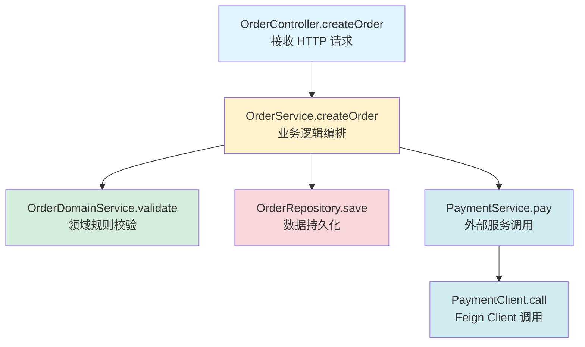
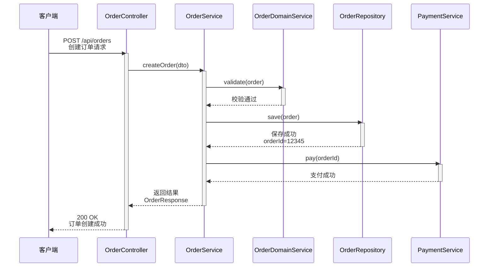
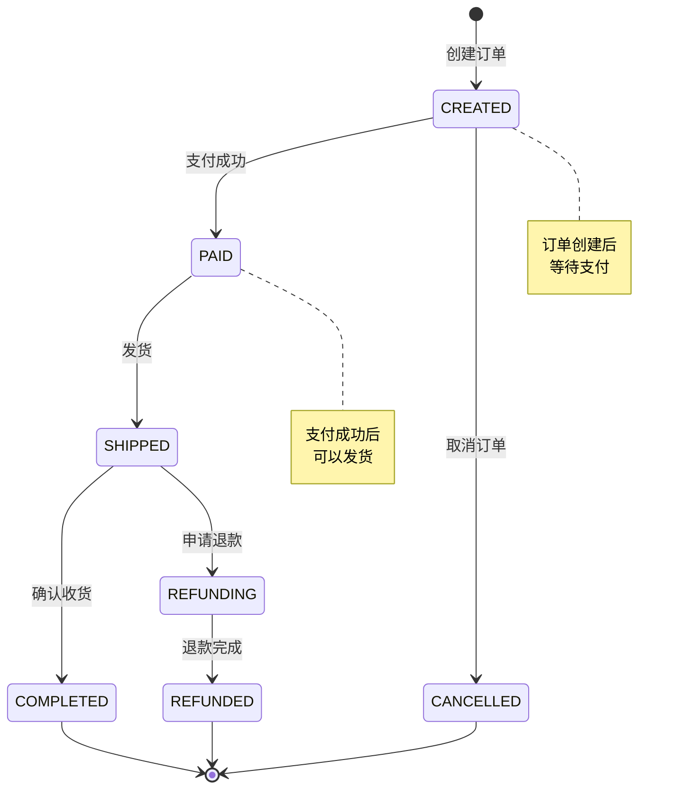

# 代码流程分析指令 (Flow Analysis Instructions)

## ⚠️ 执行规则 (EXECUTION RULES)

```
🛑 CRITICAL: 
- 每个步骤输出后 MUST STOP
- 等待用户回复后才能继续
- 一次回复只输出一个步骤的内容
- 违反此规则将导致流程失败
- 根据用户角色调整输出内容和重点
```

此文档指导 Agent 执行对特定功能的**动态流程分析（阶段 2）**。

> [!IMPORTANT]
> **目标**: 深入理解核心业务链路的执行逻辑。
> **原则**: 关注数据流向和关键决策点。
> **角色适配**:
> - **开发人员**: 重点关注调用链、技术实现、方法调用关系
> - **非开发人员**: 重点关注业务流程、业务规则、状态流转，用通俗语言解释

---

## 步骤 1: 调用链路分析 (Call Graph)

**你必须输出以下内容，然后停止**:

**⚠️ 角色适配规则**:
- **开发人员**: 详细展示调用链图，说明每个方法的作用和技术细节
- **非开发人员**: 用业务语言描述流程，说明"用户做什么 → 系统做什么 → 结果是什么"

**⚠️ 可视化规则（强制）**:
- **优先输出 Mermaid 图**，每个步骤至少一个图
- **步骤 1.1**: 优先输出调用链图（使用 `graph TD` 或 `flowchart TD`）
- **步骤 1.2**: 优先输出时序图（使用 `sequenceDiagram`）
- **步骤 1.3**: 如果涉及状态流转，优先输出状态机图（使用 `stateDiagram-v2`）
- **代码截取作为补充**：可以在图表后添加关键代码片段作为详细说明，但必须以图表为主

### 1.1 追踪调用链

**追踪内容**:
1. **输入**: 用户选定的入口点（如 `createOrder`）
2. **自顶向下追踪**: Controller -> Service -> Manager -> DAO
3. **外部调用**: Feign/Dubbo/HTTP

**⚠️ 优先输出调用链图**:
- 使用 `mermaid graph TD` 或 `flowchart TD` 绘制调用关系图
- 可以在图表后添加关键方法的代码片段作为补充说明

### 1.2 生成调用关系图

**可视化**: 使用 `mermaid graph TD` 绘制调用关系图

**⚠️ 优先输出时序图**:
- 使用 `mermaid sequenceDiagram` 展示方法调用顺序
- 可以在图表后添加关键方法的代码片段作为补充说明

### 1.3 输出调用链路

**⚠️ 如果涉及状态流转，优先输出状态机图**:
- 使用 `mermaid stateDiagram-v2` 展示状态流转
- 可以在图表后添加状态枚举的代码片段作为补充说明

**输出格式**:

**⚠️ 根据用户角色调整输出**:

**如果是开发人员**:
````markdown
## 步骤 1: 调用链路分析

📊 **进度**: [1/3] 流程分析
[███████░░░░░░░░░░░░░] 33%

| ✅ 已完成 | 🔄 进行中 | ⏳ 待完成 |
|:----------|:----------|:----------|
| | 1.调用链路分析 | 2.核心时序分析 |
| | | 3.复杂逻辑解读 |

---

### 调用链路图

**⚠️ 优先使用 Mermaid 图**:



### 调用链说明

| 层级 | 类/方法 | 职责 | 技术实现 |
|------|--------|------|---------|
| Controller | OrderController.createOrder | 接收 HTTP 请求，参数校验 | 使用 @PostMapping 注解 |
| Service | OrderService.createOrder | 业务逻辑编排 | 事务管理 @Transactional |
| Domain | OrderDomainService.validate | 领域规则校验 | 领域服务模式 |
| Repository | OrderRepository.save | 数据持久化 | JPA Repository |
| External | PaymentService.pay | 外部服务调用 | Feign Client 调用

### 关键方法代码示例（可选补充）

如果需要，可以添加关键方法的代码片段作为补充说明：

```java
// OrderService.createOrder 方法示例
@Service
@Transactional
public class OrderService {
    public OrderResponse createOrder(OrderRequest request) {
        // 1. 参数校验
        validateRequest(request);
        
        // 2. 创建订单实体
        Order order = new Order();
        order.setUserId(request.getUserId());
        order.setStatus(OrderStatus.CREATED);
        
        // 3. 保存订单
        orderRepository.save(order);
        
        // 4. 调用支付服务
        paymentService.pay(order.getId());
        
        return convertToResponse(order);
    }
}
```
````

**如果是非开发人员**:
````markdown
## 步骤 1: 业务流程说明

📊 **进度**: [1/3] 流程分析
[███████░░░░░░░░░░░░░] 33%

| ✅ 已完成 | 🔄 进行中 | ⏳ 待完成 |
|:----------|:----------|:----------|
| | 1.业务流程说明 | 2.业务规则说明 |
| | | 3.状态流转说明 |

---

### 业务流程说明

**功能**: 创建订单

**用户操作**: 用户在页面上选择商品，点击"下单"按钮

**系统处理流程**:
1. **接收订单信息** - 系统接收用户提交的订单信息（商品、数量、收货地址等）
2. **校验订单信息** - 系统检查商品库存是否充足、收货地址是否有效等
3. **创建订单** - 如果校验通过，系统创建订单并保存到数据库
4. **调用支付服务** - 系统调用支付服务，准备进行支付
5. **返回结果** - 系统返回订单创建成功的结果给用户

**业务结果**: 
- ✅ 成功：订单创建成功，用户可以继续支付
- ❌ 失败：如果库存不足或地址无效，订单创建失败，系统提示用户原因
````

---

📋 **确认检查点**

调用链路分析是否准确？

- 回复 **确认** → 进入核心时序分析
- 回复 **补充调用: [方法名]** → 我将添加
- 回复 **调整: [内容]** → 我将调整

**请确认：** 调用链路是否正确？
````

**🛑 STOP HERE - DO NOT OUTPUT STEP 2 UNTIL USER CONFIRMS**

⚠️ **重要**: 用户未回复"确认"前，禁止执行任何后续步骤，禁止输出步骤2的内容。

---

## 步骤 2: 核心时序分析 (Sequence)

**你必须输出以下内容，然后停止**:

**⚠️ 角色适配规则**:
- **开发人员**: 详细展示时序图，说明方法调用顺序、数据流转、技术细节
- **非开发人员**: 用业务语言描述时序，说明"用户操作 → 系统处理 → 返回结果"的业务流程

### 2.1 分析核心逻辑

**分析内容**:
1. **异步处理**: Async/Event
2. **事务边界**: Transaction
3. **异常处理**: Try-Catch

### 2.2 生成时序图

**可视化**: 使用 `mermaid sequenceDiagram` 绘制时序图，标注关键数据变更

### 2.3 输出时序分析

**输出格式**:

````markdown
## 步骤 2: 核心时序分析

📊 **进度**: [2/3] 流程分析
[█████████████░░░░░░░] 67%

| ✅ 已完成 | 🔄 进行中 | ⏳ 待完成 |
|:----------|:----------|:----------|
| 1.调用链路分析 | 2.核心时序分析 | 3.复杂逻辑解读 |

---

### 时序图

**⚠️ 优先使用 Mermaid sequenceDiagram**:



### 关键数据变更

| 步骤 | 数据变更 | 说明 |
|------|---------|------|
| validate | order.status = CREATED | 订单状态初始化 |
| save | order.id = 12345 | 生成订单ID |
| pay | order.status = PAID | 支付后状态更新 |

### 关键方法代码示例（可选补充）

如果需要，可以添加关键方法的代码片段作为补充说明：

```java
// OrderService.createOrder 方法时序关键代码
public OrderResponse createOrder(OrderRequest dto) {
    // Controller -> Service
    Order order = convertToEntity(dto);
    
    // Service -> Domain
    orderDomainService.validate(order);
    
    // Service -> Repository
    order = orderRepository.save(order);
    
    // Service -> External
    paymentService.pay(order.getId());
    
    return convertToResponse(order);
}
```

---

📋 **确认检查点**

时序分析是否准确？

- 回复 **确认** → 进入复杂逻辑解读
- 回复 **补充时序: [步骤]** → 我将添加
- 回复 **调整: [内容]** → 我将调整

**请确认：** 时序分析是否正确？
````

**🛑 STOP HERE - DO NOT OUTPUT STEP 3 UNTIL USER CONFIRMS**

⚠️ **重要**: 用户未回复"确认"前，禁止执行任何后续步骤，禁止输出步骤3的内容。

---

## 步骤 3: 复杂逻辑解读

**你必须输出以下内容，然后停止**:

### 3.1 识别复杂逻辑

**识别内容**:
1. **复杂条件**: if-else / switch 状态机
2. **复杂算法**: 计算逻辑

### 3.2 解释核心逻辑

**解释方式**:
1. **自然语言**: 用伪代码解释核心算法
2. **状态图**: 如果涉及状态流转，绘制 `mermaid stateDiagram`

### 3.3 输出逻辑解读

**输出格式**:

````markdown
## 步骤 3: 复杂逻辑解读

📊 **进度**: [3/3] 流程分析
[████████████████████] 100%

| ✅ 已完成 | 🔄 进行中 | ⏳ 待完成 |
|:----------|:----------|:----------|
| 1.调用链路分析 | 3.复杂逻辑解读 | |
| 2.核心时序分析 | | |

---

### 状态机逻辑

**⚠️ 优先使用 Mermaid stateDiagram-v2**:



### 核心算法说明

**订单金额计算逻辑**（优先用流程图展示）:

```mermaid
flowchart TD
    Start[开始计算订单金额] --> CalcItemTotal[计算商品总价<br/>sum(商品单价 * 数量)]
    CalcItemTotal --> ApplyDiscount[应用优惠券/活动<br/>计算优惠金额]
    ApplyDiscount --> CalcShipping[根据地址计算运费]
    CalcShipping --> CalcFinal[最终金额 = 商品总价 - 优惠金额 + 运费]
    CalcFinal --> End[返回最终金额]
    
    style Start fill:#d4edda
    style End fill:#d4edda
    style CalcItemTotal fill:#fff3cd
    style ApplyDiscount fill:#fff3cd
    style CalcShipping fill:#fff3cd
    style CalcFinal fill:#e1f5ff
```

### 核心算法代码示例（可选补充）

如果需要，可以添加核心算法的代码片段作为补充说明：

```java
// 订单金额计算逻辑代码示例
public BigDecimal calculateOrderAmount(Order order) {
    // 1. 计算商品总价
    BigDecimal itemTotal = order.getItems().stream()
        .map(item -> item.getUnitPrice().multiply(BigDecimal.valueOf(item.getQuantity())))
        .reduce(BigDecimal.ZERO, BigDecimal::add);
    
    // 2. 应用优惠券/活动
    BigDecimal discount = applyDiscount(order, itemTotal);
    
    // 3. 计算运费
    BigDecimal shippingFee = calculateShippingFee(order.getAddress());
    
    // 4. 最终金额
    return itemTotal.subtract(discount).add(shippingFee);
}
```

---

📋 **确认检查点**

复杂逻辑解读是否清晰？

- 回复 **确认** → 进入影响面分析阶段
- 回复 **补充逻辑: [逻辑说明]** → 我将添加
- 回复 **调整: [内容]** → 我将调整

**请确认：** 复杂逻辑解读是否清晰？
````

**🛑 STOP HERE - 必须等待用户确认后才能继续**

⚠️ **重要**: 用户未回复"确认"前，禁止执行任何后续步骤。

---

## 阶段 2 完成: 准备进入影响面分析

**触发条件**: 用户确认步骤3后

**输出格式**:

````markdown
---

## ✅ 阶段 2 完成

| ✅ 已完成 | 🔄 即将开始 |
|:----------|:------------|
| 阶段1: 静态结构分析 | 阶段3: 影响面分析 |
| 阶段2: 流程分析 | |

**流程分析已完成**:
- ✅ 调用链路已分析
- ✅ 时序图已生成
- ✅ 复杂逻辑已解读

---

🛑 **下一步**

是否进入影响面分析阶段？

请回复：
- **继续** → 进入影响面分析
- **结束** → 完成当前分析
````

**🛑 STOP HERE - 等待用户确认进入下一阶段**