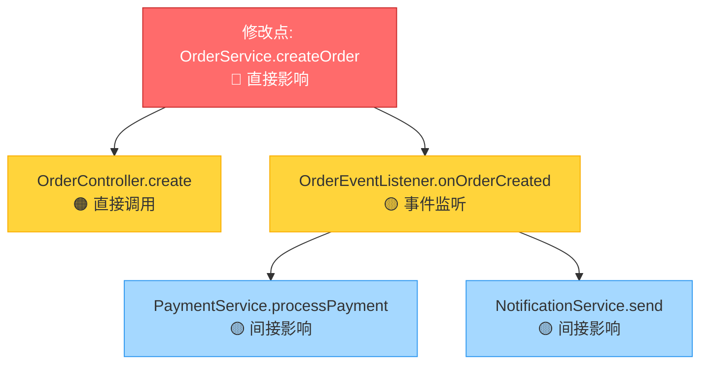
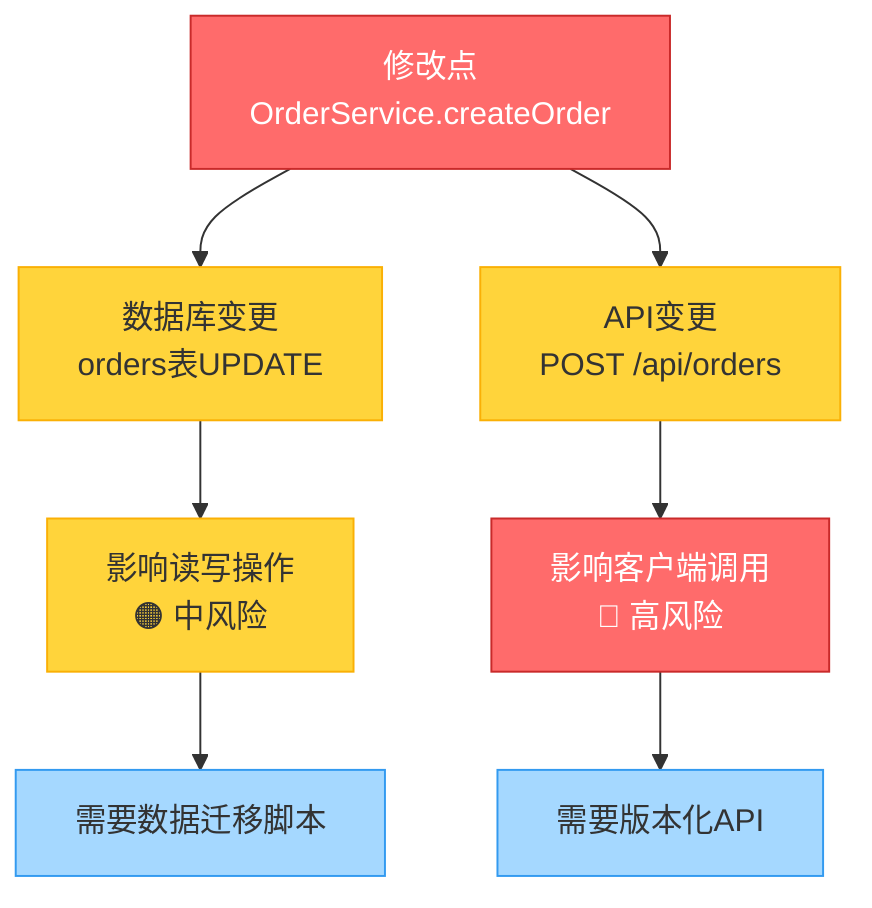

# 影响面分析指令 (Impact Analysis Instructions)

## ⚠️ 执行规则 (EXECUTION RULES)

```
🛑 CRITICAL: 
- 每个步骤输出后 MUST STOP
- 等待用户回复后才能继续
- 一次回复只输出一个步骤的内容
- 违反此规则将导致流程失败
```

此文档指导 Agent 执行代码变更的**影响面分析（阶段 3）**。

> [!IMPORTANT]
> **目标**: 评估变更风险，防止回归问题。
> **场景**: 准备修改代码前、排查 Bug 时。

---

## 步骤 1: 依赖引用分析 (Usage Search)

**你必须输出以下内容，然后停止**:

### 1.1 搜索引用

**搜索内容**:
1. **输入**: 拟修改的类、方法或字段
2. **查找引用**: 所有引用处 (Usages)
3. **递归查找**: 上游调用者

### 1.2 分类影响

**分类方式**:
1. **直接影响**: 直接调用者
2. **间接影响**: 上游的上游，或通过 Event/MQ 触发的下游

### 1.3 输出依赖分析

**输出格式**:

````markdown
## 步骤 1: 依赖引用分析

📊 **进度**: [1/3] 影响面分析
[███████░░░░░░░░░░░░░] 33%

| ✅ 已完成 | 🔄 进行中 | ⏳ 待完成 |
|:----------|:----------|:----------|
| | 1.依赖引用分析 | 2.数据影响分析 |
| | | 3.风险评估报告 |

---

### 直接影响范围

| 文件 | 方法 | 调用方式 | 影响类型 |
|------|------|---------|---------|
| OrderService.java | createOrder() | 直接调用 | 直接影响 |
| OrderController.java | create() | 直接调用 | 直接影响 |

### 间接影响范围

| 文件 | 方法 | 调用方式 | 影响类型 |
|------|------|---------|---------|
| OrderEventListener.java | onOrderCreated() | 事件监听 | 间接影响 |
| PaymentService.java | processPayment() | MQ消费 | 间接影响 |

### 影响关系图

**⚠️ 优先使用 Mermaid 图**:



### 关键代码示例（可选补充）

如果需要，可以添加受影响的关键代码片段作为补充说明：

```java
// OrderController.create 方法（受影响）
@PostMapping("/orders")
public OrderResponse create(@RequestBody OrderRequest request) {
    // 直接调用 OrderService.createOrder
    return orderService.createOrder(request);  // ⚠️ 受影响
}

// OrderEventListener.onOrderCreated（间接影响）
@EventListener
public void onOrderCreated(OrderCreatedEvent event) {
    // 监听 OrderService.createOrder 产生的事件
    paymentService.processPayment(event.getOrderId());  // ⚠️ 间接影响
}
```

---

📋 **确认检查点**

依赖引用分析是否完整？

- 回复 **确认** → 进入数据影响分析
- 回复 **补充引用: [文件路径]** → 我将添加
- 回复 **调整: [内容]** → 我将调整

**请确认：** 依赖引用分析是否完整？
````

**🛑 STOP HERE - DO NOT OUTPUT STEP 2 UNTIL USER CONFIRMS**

⚠️ **重要**: 用户未回复"确认"前，禁止执行任何后续步骤，禁止输出步骤2的内容。

---

## 步骤 2: 数据影响分析

**你必须输出以下内容，然后停止**:

### 2.1 数据库影响

**分析内容**:
1. **Schema变更**: 如果修改了表结构，影响哪些读/写操作
2. **SQL变更**: 如果修改了SQL，影响哪些查询

### 2.2 API影响

**分析内容**:
1. **DTO变更**: 是否破坏向后兼容性 (Breaking Change)
2. **接口变更**: 参数或返回值变化

### 2.3 输出数据影响

**输出格式**:

````markdown
## 步骤 2: 数据影响分析

📊 **进度**: [2/3] 影响面分析
[█████████████░░░░░░░] 67%

| ✅ 已完成 | 🔄 进行中 | ⏳ 待完成 |
|:----------|:----------|:----------|
| 1.依赖引用分析 | 2.数据影响分析 | 3.风险评估报告 |

---

### 数据库影响

| 表名 | 操作类型 | 影响范围 | 风险等级 |
|------|---------|---------|---------|
| orders | UPDATE | 订单状态更新 | ⚠️ 高风险 |
| order_items | INSERT | 订单项创建 | ✅ 低风险 |

### API影响

| 接口 | 变更类型 | 兼容性 | 风险等级 |
|------|---------|--------|---------|
| POST /api/orders | 参数新增 | 向后兼容 | ✅ 低风险 |
| GET /api/orders/{id} | 返回值变更 | 不兼容 | 🔴 高风险 |

### 数据流影响

**⚠️ 优先使用 Mermaid 图**:



### 关键代码示例（可选补充）

如果需要，可以添加受影响的关键代码片段作为补充说明：

```java
// 数据库变更示例（受影响）
@Table(name = "orders")
public class Order {
    // 新增字段
    @Column(name = "new_field")
    private String newField;  // ⚠️ 需要数据迁移
    
    // 修改字段类型
    @Column(name = "status")
    private OrderStatus status;  // ⚠️ 可能影响现有查询
}

// API 变更示例（受影响）
@PostMapping("/api/orders")
public OrderResponse create(@RequestBody OrderRequest request) {
    // 新增参数
    String newParam = request.getNewParam();  // ⚠️ 向后兼容
}
```

---

📋 **确认检查点**

数据影响分析是否准确？

- 回复 **确认** → 进入风险评估报告
- 回复 **补充影响: [影响点]** → 我将添加
- 回复 **调整: [内容]** → 我将调整

**请确认：** 数据影响分析是否准确？
````

**🛑 STOP HERE - DO NOT OUTPUT STEP 3 UNTIL USER CONFIRMS**

⚠️ **重要**: 用户未回复"确认"前，禁止执行任何后续步骤，禁止输出步骤3的内容。

---

## 步骤 3: 风险评估报告

**你必须输出以下内容，然后停止**:

### 3.1 生成报告

**报告内容**:
1. **影响范围**: 列出受影响的模块和接口
2. **风险等级**: High/Medium/Low
3. **测试建议**: 建议回归测试哪些用例？需要新增哪些单元测试？

### 3.2 输出风险评估

**输出格式**:

````markdown
## 步骤 3: 风险评估报告

📊 **进度**: [3/3] 影响面分析
[████████████████████] 100%

| ✅ 已完成 | 🔄 进行中 | ⏳ 待完成 |
|:----------|:----------|:----------|
| 1.依赖引用分析 | 3.风险评估报告 | |
| 2.数据影响分析 | | |

---

### 影响范围汇总

| 影响类型 | 数量 | 风险等级 |
|---------|------|---------|
| 直接影响 | 2 | ⚠️ 中风险 |
| 间接影响 | 3 | 🔴 高风险 |
| 数据库影响 | 2 | ⚠️ 中风险 |
| API影响 | 1 | 🔴 高风险 |

### 风险评估

| 风险项 | 风险等级 | 影响范围 | 缓解措施 |
|--------|---------|---------|---------|
| API不兼容变更 | 🔴 高风险 | 所有客户端 | 版本化API，保留旧版本 |
| 数据库结构变更 | ⚠️ 中风险 | 数据读写 | 数据迁移脚本，灰度发布 |
| 事件监听影响 | 🔴 高风险 | 下游服务 | 向后兼容事件格式 |

### 测试建议

**回归测试用例**:
- [ ] TC-001: 正常创建订单流程
- [ ] TC-002: 订单状态流转测试
- [ ] TC-003: 支付流程集成测试

**新增单元测试**:
- [ ] UT-001: OrderService.createOrder 边界测试
- [ ] UT-002: 异常场景测试

---

📋 **确认检查点**

风险评估报告是否完整？

- 回复 **确认** → 生成完整分析报告
- 回复 **补充风险: [风险项]** → 我将添加
- 回复 **调整: [内容]** → 我将调整

**请确认：** 风险评估报告是否完整？
````

**🛑 STOP HERE - 必须等待用户确认后才能继续**

⚠️ **重要**: 用户未回复"确认"前，禁止执行任何后续步骤。

---

## 阶段 3 完成: 生成完整分析报告

**触发条件**: 用户确认步骤3后

**输出格式**:

````markdown
---

## ✅ 阶段 3 完成

| ✅ 已完成 |
|:----------|
| 阶段1: 静态结构分析 |
| 阶段2: 流程分析 |
| 阶段3: 影响面分析 |

**影响面分析已完成**:
- ✅ 依赖引用已分析
- ✅ 数据影响已评估
- ✅ 风险评估报告已生成

---

## ✅ 代码分析完成

### 📄 已写入文件

**文件**: `jl-skills/generated/analyze/{date}/Code_Analysis_Report.md`

**包含内容**:
- ✓ 技术栈和项目结构
- ✓ 核心实体和ER图
- ✓ 接口和入口点
- ✓ 调用链路分析
- ✓ 时序图
- ✓ 复杂逻辑解读
- ✓ 依赖引用分析
- ✓ 数据影响分析
- ✓ 风险评估报告

---

**后续建议**: 根据风险评估报告制定修改计划
````

**🛑 STOP HERE - 分析完成**