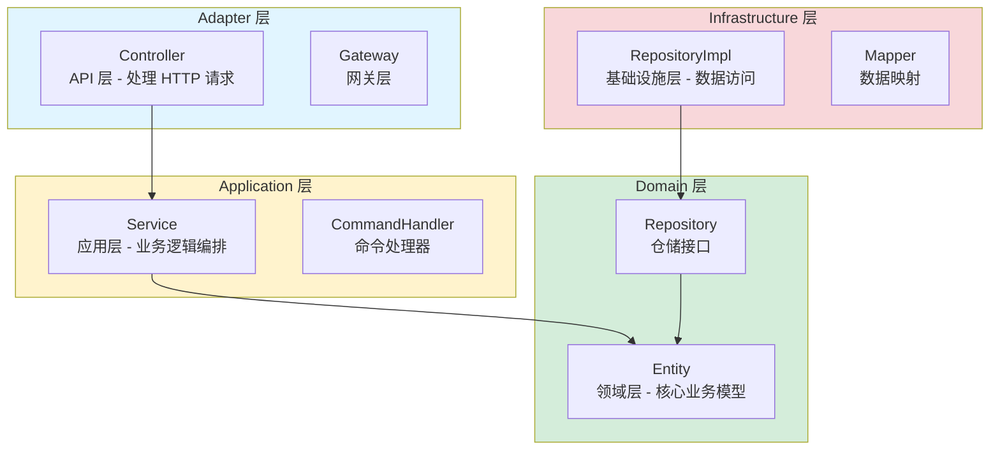
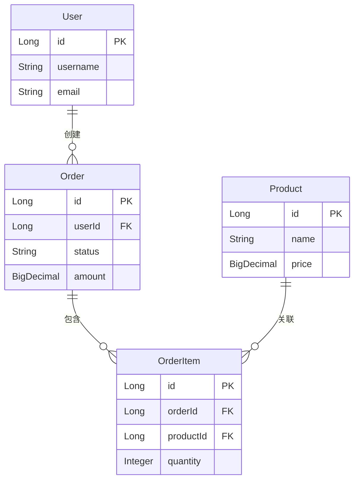

# 代码结构分析指令 (Structure Analysis Instructions)

## ⚠️ 执行规则 (EXECUTION RULES)

```
🛑 CRITICAL: 
- 每个步骤输出后 MUST STOP
- 等待用户回复后才能继续
- 一次回复只输出一个步骤的内容
- 违反此规则将导致流程失败
- 根据用户角色调整输出内容和重点
```

此文档指导 Agent 执行对陌生代码的**静态结构分析（阶段 1）**。

> [!IMPORTANT]
> **目标**: 快速建立对代码库的宏观认知。
> **场景**: 接手新项目、阅读开源代码。
> **角色适配**:
> - **开发人员**: 重点关注技术栈、架构设计、模块划分
> - **非开发人员**: 重点关注功能模块、业务边界、数据模型

---

## 步骤 1: 技术栈与项目概览

**你必须输出以下内容，然后停止**:

**⚠️ 角色适配规则**:
- **开发人员**: 详细列出技术栈版本、框架配置、依赖关系
- **非开发人员**: 用通俗语言说明技术栈的作用，重点说明功能模块

**⚠️ 可视化规则（强制）**:
- **优先输出 Mermaid 图**，每个步骤至少一个图
- **步骤 1.1**: 优先输出模块结构图（使用 `flowchart TD` 或 `graph TD`）
- **步骤 1.2**: 优先输出 ER 图（使用 `erDiagram`）
- **步骤 1.3**: 优先输出接口关系图（使用 `graph` 或 `flowchart`）
- **代码截取作为补充**：可以在图表后添加关键代码片段作为详细说明，但必须以图表为主

### 1.1 识别技术栈

**识别内容**:
1. **构建工具**: Maven/Gradle/npm
2. **核心框架**: Spring Boot/React/Django
3. **关键依赖库**: 主要第三方库

**⚠️ 优先输出模块结构图**:
- 使用 `mermaid flowchart TD` 或 `graph TD` 展示模块划分和分层架构
- 可以在图表后添加关键代码片段作为补充说明

### 1.2 分析项目结构

**分析内容**:
1. **模块划分**: Modules/Packages
2. **分层架构**: Controller/Service/Dao

**⚠️ 优先输出 ER 图**:
- 使用 `mermaid erDiagram` 展示核心实体关系
- 可以在图表后添加关键实体类的代码片段作为补充说明

### 1.3 输出技术概览

**⚠️ 优先输出接口关系图**:
- 使用 `mermaid graph` 或 `flowchart` 展示接口调用关系
- 可以在图表后添加关键接口的代码片段作为补充说明

**输出格式**:

**⚠️ 根据用户角色调整输出**:

**如果是开发人员**:
````markdown
## 步骤 1: 技术栈与项目概览

📊 **进度**: [1/3] 静态结构分析
[███████░░░░░░░░░░░░░] 33%

| ✅ 已完成 | 🔄 进行中 | ⏳ 待完成 |
|:----------|:----------|:----------|
| | 1.技术栈概览 | 2.核心实体与ER图 |
| | | 3.接口与入口点 |

---

### 技术栈概览

| 类型 | 技术 | 版本 | 说明 |
|------|------|------|------|
| 构建工具 | Maven | 3.8+ | 项目构建和依赖管理 |
| 核心框架 | Spring Boot | 3.x | Web 应用框架 |
| 数据库 | MySQL | 8.0 | 关系型数据库 |
| 缓存 | Redis | 7.x | 内存缓存 |

### 项目结构（分层架构）

**⚠️ 优先使用 Mermaid 图展示**:



### 架构说明
- **分层设计**: 采用 DDD 分层架构，依赖方向：Controller → Service → Domain ← Infrastructure
- **技术选型**: Spring Boot 3.x，支持响应式编程

### 关键代码示例（可选补充）

如果需要，可以添加关键代码片段作为补充说明：

```java
// Controller 层示例
@RestController
@RequestMapping("/api/orders")
public class OrderController {
    @Autowired
    private OrderService orderService;
    
    @PostMapping
    public OrderResponse createOrder(@RequestBody OrderRequest request) {
        return orderService.createOrder(request);
    }
}
```
````

**如果是非开发人员**:
````markdown
## 步骤 1: 功能模块概览

📊 **进度**: [1/3] 功能分析
[███████░░░░░░░░░░░░░] 33%

| ✅ 已完成 | 🔄 进行中 | ⏳ 待完成 |
|:----------|:----------|:----------|
| | 1.功能模块概览 | 2.业务数据模型 |
| | | 3.功能入口点 |

---

### 功能模块说明

这个系统主要包含以下功能模块：

| 模块名称 | 功能说明 | 主要作用 |
|---------|---------|---------|
| 订单模块 | 处理订单相关功能 | 用户可以创建订单、查看订单状态、取消订单等 |
| 支付模块 | 处理支付相关功能 | 用户可以支付订单、查询支付状态等 |
| 用户模块 | 处理用户相关功能 | 用户可以注册、登录、查看个人信息等 |

### 业务数据说明

系统主要管理以下业务数据：
- **订单数据**: 记录订单信息、订单状态、订单金额等
- **用户数据**: 记录用户信息、用户权限等
- **商品数据**: 记录商品信息、商品库存等
````

---

📋 **确认检查点**

技术栈和项目结构分析是否准确？

- 回复 **确认** → 进入核心实体与ER图分析
- 回复 **补充: [内容]** → 我将补充
- 回复 **调整: [内容]** → 我将调整

**请确认：** 技术栈和项目结构是否正确？
````

**🛑 STOP HERE - DO NOT OUTPUT STEP 2 UNTIL USER CONFIRMS**

⚠️ **重要**: 用户未回复"确认"前，禁止执行任何后续步骤，禁止输出步骤2的内容。

---

## 步骤 2: 核心实体与ER图

**你必须输出以下内容，然后停止**:

**⚠️ 角色适配规则**:
- **开发人员**: 详细展示 ER 图，说明实体关系、字段含义、数据库设计
- **非开发人员**: 用业务语言说明数据模型，说明"系统记录什么信息，这些信息之间的关系"

### 2.1 识别核心实体

**识别内容**:
1. **核心领域对象**: Entities/Models
2. **数据库表定义**: Schema

### 2.2 生成ER图

**可视化**: 使用 `mermaid erDiagram` 绘制实体关系图

### 2.3 输出实体分析

**输出格式**:

````markdown
## 步骤 2: 核心实体与ER图

📊 **进度**: [2/3] 静态结构分析
[█████████████░░░░░░░] 67%

| ✅ 已完成 | 🔄 进行中 | ⏳ 待完成 |
|:----------|:----------|:----------|
| 1.技术栈概览 | 2.核心实体与ER图 | 3.接口与入口点 |

---

### 核心实体列表

| 实体名称 | 说明 | 表名 |
|---------|------|------|
| Order | 订单 | orders |
| User | 用户 | users |
| Product | 商品 | products |
| OrderItem | 订单项 | order_items |

### 实体关系图

**⚠️ 优先使用 Mermaid erDiagram**:



### 关键实体代码示例（可选补充）

如果需要，可以添加关键实体类的代码片段作为补充说明：

```java
// Order 实体示例
@Entity
@Table(name = "orders")
public class Order {
    @Id
    @GeneratedValue(strategy = GenerationType.IDENTITY)
    private Long id;
    
    @ManyToOne
    @JoinColumn(name = "user_id")
    private User user;
    
    @OneToMany(mappedBy = "order", cascade = CascadeType.ALL)
    private List<OrderItem> items;
    
    private String status;
    private BigDecimal amount;
}
```

---

📋 **确认检查点**

核心实体和ER图是否准确？

- 回复 **确认** → 进入接口与入口点分析
- 回复 **补充实体: [实体名称]** → 我将添加
- 回复 **调整: [内容]** → 我将调整

**请确认：** 核心实体和ER图是否正确？
````

**🛑 STOP HERE - DO NOT OUTPUT STEP 3 UNTIL USER CONFIRMS**

⚠️ **重要**: 用户未回复"确认"前，禁止执行任何后续步骤，禁止输出步骤3的内容。

---

## 步骤 3: 接口与入口点

**你必须输出以下内容，然后停止**:

### 3.1 扫描入口点

**扫描内容**:
1. **API接口**: Controller/RPC
2. **消息消费者**: MQ Listener
3. **定时任务**: Job

### 3.2 输出接口清单

**输出格式**:

````markdown
## 步骤 3: 接口与入口点

📊 **进度**: [3/3] 静态结构分析
[████████████████████] 100%

| ✅ 已完成 | 🔄 进行中 | ⏳ 待完成 |
|:----------|:----------|:----------|
| 1.技术栈概览 | 3.接口与入口点 | |
| 2.核心实体与ER图 | | |

---

### API 接口清单

| 接口路径 | 方法 | 说明 | Controller |
|---------|------|------|-----------|
| `/api/orders` | POST | 创建订单 | OrderController |
| `/api/orders/{id}` | GET | 查询订单 | OrderController |

### 消息消费者

| Topic/Queue | 说明 | Listener |
|------------|------|---------|
| `order.created` | 订单创建事件 | OrderEventListener |

### 定时任务

| 任务名称 | Cron | 说明 | Job |
|---------|------|------|-----|
| 订单超时检查 | 0 */5 * * * ? | 检查超时订单 | OrderTimeoutJob |

---

📋 **确认检查点**

接口和入口点分析是否完整？

- 回复 **确认** → 进入流程分析阶段
- 回复 **补充接口: [接口路径]** → 我将添加
- 回复 **调整: [内容]** → 我将调整

**请确认：** 接口和入口点分析是否完整？
````

**🛑 STOP HERE - 必须等待用户确认后才能继续**

⚠️ **重要**: 用户未回复"确认"前，禁止执行任何后续步骤。

---

## 阶段 1 完成: 准备进入流程分析

**触发条件**: 用户确认步骤3后

**输出格式**:

````markdown
---

## ✅ 阶段 1 完成

| ✅ 已完成 | 🔄 即将开始 |
|:----------|:------------|
| 阶段1: 静态结构分析 | 阶段2: 流程分析 |

**静态结构分析已完成**:
- ✅ 技术栈已识别
- ✅ 核心实体已分析
- ✅ 接口和入口点已列出

---

🛑 **下一步**

您最关心哪个功能的实现细节？我将深入分析其调用链路和时序。

请回复：
- **分析 [功能名称]** → 进入流程分析阶段
- **结束** → 完成当前分析
````

**🛑 STOP HERE - 等待用户确认进入下一阶段**