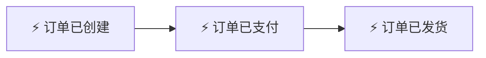
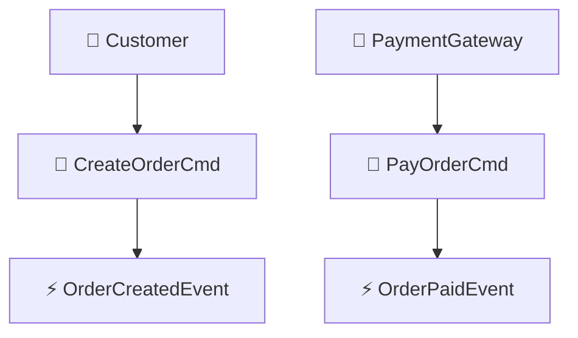
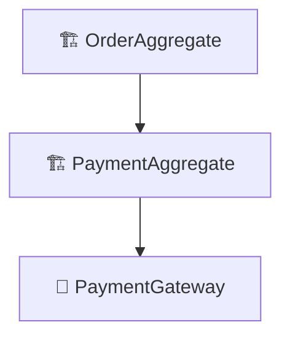
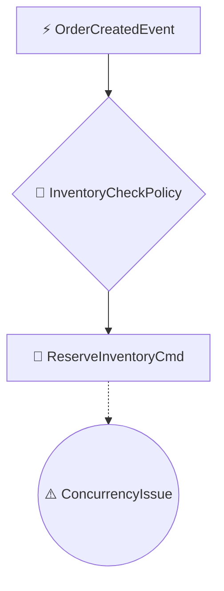
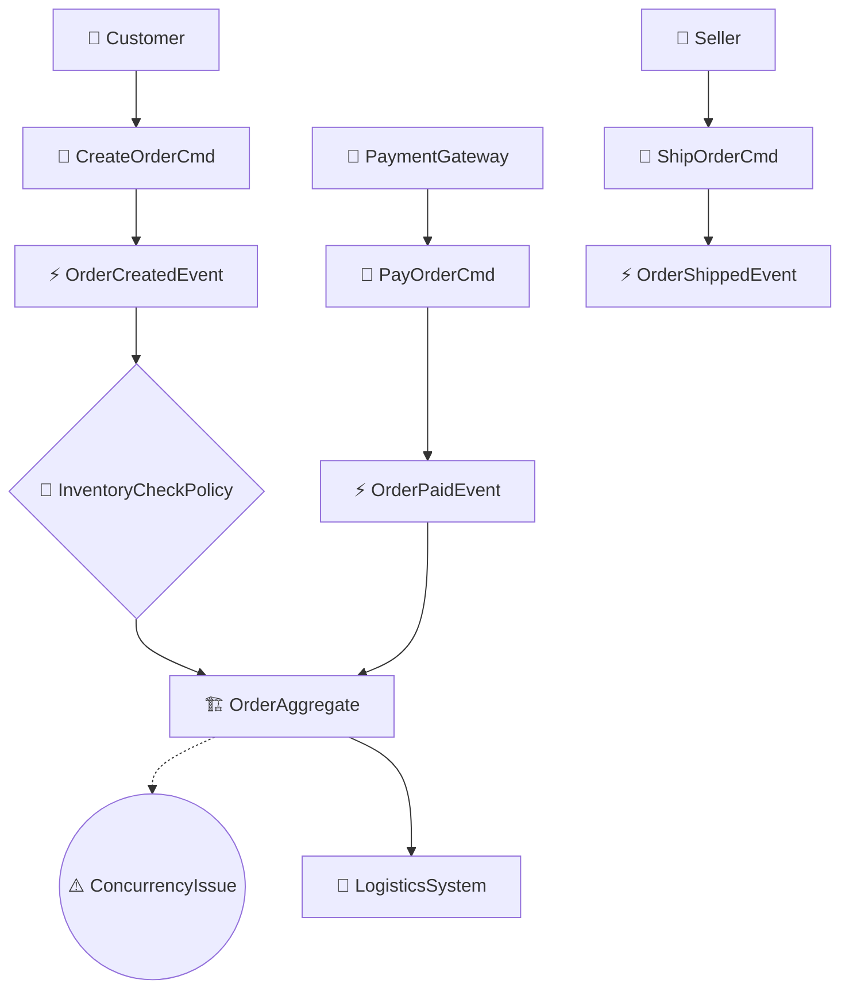
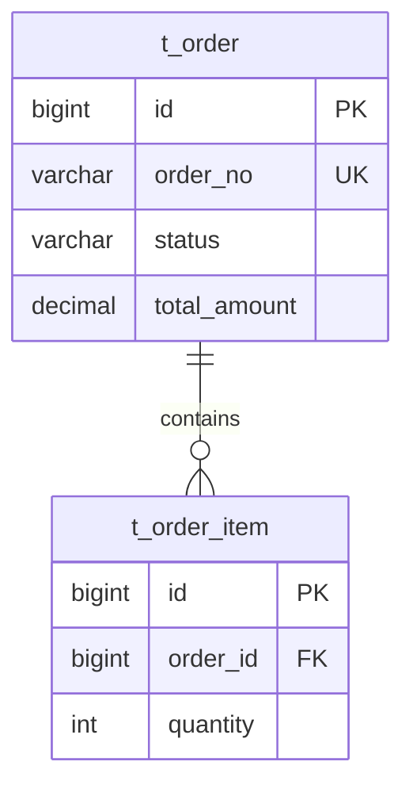

# 事件风暴指令 (Event Storming Instructions)

## ⚠️ 执行规则 (EXECUTION RULES)

```
🛑 CRITICAL: 
- 每个步骤输出后 MUST STOP
- 等待用户回复后才能继续
- 一次回复只输出一个步骤的内容
- 违反此规则将导致流程失败
```

## ⚠️ 可视化规范 (VISUALIZATION STANDARD)

**生成 Mermaid 图表时，必须读取并遵循**:

📄 **`jl-skills/specs/DDD与可视化规范.md`**

从该文件获取：
- classDef 样式定义
- Emoji 标签规范
- Mermaid 模板结构

---

## 步骤 2.1: 领域事件

**你必须输出以下内容，然后停止**:

```markdown
## 步骤 2.1: 领域事件

📊 **进度**: [1/12] 领域事件
[██░░░░░░░░░░░░░░░░░░] 8%

| ✅ 已完成 | 🔄 进行中 | ⏳ 待完成 |
|:----------|:----------|:----------|
| | 2.1 领域事件 | 2.2 命令识别 |
| | | 2.3 聚合识别 |
| | | ... |

---

### 🟧 领域事件 (Domain Events)

> 命名规则：`名词 + 动词过去分词`，如 OrderCreatedEvent

| 序号 | 事件名称 | 中文描述 | 所属聚合 |
|------|----------|----------|----------|
| E01 | OrderCreatedEvent | 订单已创建 | Order |
| E02 | OrderPaidEvent | 订单已支付 | Order |

### 事件时间线



---

🛑 **确认点**

领域事件是否完整？是否有遗漏？

请回复：
- **确认** → 进入命令识别
- **补充 [事件描述]** → 我将添加
```

**🛑 STOP HERE**

---

## 步骤 2.2: 命令识别

**前置条件**: 用户已确认步骤 2.1

```markdown
## 步骤 2.2: 命令识别

📊 **进度**: [2/12] 命令识别
[████░░░░░░░░░░░░░░░░] 16%

| ✅ 已完成 | 🔄 进行中 | ⏳ 待完成 |
|:----------|:----------|:----------|
| 2.1 领域事件 | 2.2 命令识别 | 2.3 聚合识别 |
| | | ... |

---

### 🟦 命令 (Commands) 与触发源

> 命名规则：`动词 + 名词`，如 CreateOrderCmd

| 命令 | 触发的事件 | 来源类型 | 触发者 |
|------|------------|----------|--------|
| CreateOrderCmd | OrderCreatedEvent | 用户 | Customer |
| PayOrderCmd | OrderPaidEvent | 外部系统 | PaymentGateway |

### 命令-事件关系图



---

🛑 **确认点**

命令与事件的对应关系是否正确？

请回复：
- **确认** → 进入聚合识别
- **补充** → 我将添加
```

**🛑 STOP HERE**

---

## 步骤 2.3: 聚合识别

**前置条件**: 用户已确认步骤 2.2

```markdown
## 步骤 2.3: 聚合识别

📊 **进度**: [3/12] 聚合识别
[██████░░░░░░░░░░░░░░] 25%

| ✅ 已完成 | 🔄 进行中 | ⏳ 待完成 |
|:----------|:----------|:----------|
| 2.1 领域事件 | 2.3 聚合识别 | 2.4 策略热点 |
| 2.2 命令识别 | | ... |

---

### 🟨 聚合 (Aggregates)

| 聚合 | 聚合根 | 包含实体 | 值对象 |
|------|--------|----------|--------|
| OrderAggregate | Order | OrderItem | Money, Address |

### 聚合关系图



---

🛑 **确认点**

聚合边界划分是否合理？

请回复：
- **确认** → 进入策略与热点
- **调整边界** → 我将重新划分
```

**🛑 STOP HERE**

---

## 步骤 2.4: 策略与热点

**前置条件**: 用户已确认步骤 2.3

```markdown
## 步骤 2.4: 策略与热点

📊 **进度**: [4/12] 策略与热点
[████████░░░░░░░░░░░░] 33%

---

### 🟣 策略/规则 (Policies)

| 策略ID | 触发事件 | 条件 | 执行命令 |
|--------|----------|------|----------|
| P01 | OrderCreatedEvent | - | ReserveInventoryCmd |

### 🔴 热点 (Hotspots)

| 热点ID | 类型 | 描述 | 风险等级 |
|--------|------|------|----------|
| H01 | 并发 | 库存扣减并发冲突 | 高 |

### 策略与热点图示



---

🛑 **确认点**

策略和热点是否完整？

请回复：
- **确认** → 进入事件风暴全景图
- **讨论 H0X** → 我们深入讨论
```

**🛑 STOP HERE**

---

## 步骤 2.5: 事件风暴全景图

**前置条件**: 用户已确认步骤 2.4

**重点**: 必须读取 `jl-skills/specs/DDD与可视化规范.md` 获取样式！

```markdown
## 步骤 2.5: 事件风暴全景图

📊 **进度**: [5/12] 事件风暴图
[██████████░░░░░░░░░░] 41%

---

### 🎨 事件风暴全景图



### 图例

> 参见 `jl-skills/specs/DDD与可视化规范.md` 的元素 Emoji 规范表

---

🛑 **确认点**

事件风暴图是否完整准确？

请回复：
- **确认** → 进入限界上下文划分
- **调整** → 我将修改图表
```

**🛑 STOP HERE**

---

## 步骤 2.6 - 2.11

**每个步骤都遵循相同的模式**，Mermaid 样式从规范文件获取。

---

## 步骤 2.12: 数据库设计

**前置条件**: 用户已确认步骤 2.11

```markdown
## 步骤 2.12: 数据库设计

📊 **进度**: [12/12] 数据库设计
[████████████████████] 100%

---

### 从领域模型推导数据库表

| 领域概念 | 映射规则 | 表名 |
|----------|----------|------|
| 聚合根 | → 主表 | t_order |
| 实体 | → 关联表 | t_order_item |
| 值对象 | → 嵌入字段 | status VARCHAR |

### ER 图



---

🛑 **确认点**

数据库设计是否合理？

请回复：
- **确认** → 完成阶段2，写入文档
- **调整** → 我将修改
```

**🛑 STOP HERE**

---

## 阶段2完成: 自动写入文档

**触发条件**: 用户确认步骤 2.12 后，**立即执行以下操作**：

### 1. 写入文件

```
写入文件: jl-skills/generated/design/{date}/DDD_Design.md
模板: jl-skills/templates/JL-Template-DDD-Design.md
```

### 2. 输出阶段完成总结

```markdown
---

## ✅ 阶段2完成: DDD设计

| ✅ 已完成 | 🔄 即将开始 |
|:----------|:------------|
| 阶段1: 产研设计 | 阶段3: 知识补充 |
| 阶段2: DDD设计 | |

### 📄 已写入文件

**文件**: `jl-skills/generated/design/{date}/DDD_Design.md`

**包含内容**:
- ✓ 事件风暴 (事件、命令、聚合、策略、热点)
- ✓ 限界上下文 + Context Map
- ✓ 子域划分
- ✓ 聚合根设计 (类图)
- ✓ 实体与值对象
- ✓ 聚合间关系
- ✓ 可视化图表
- ✓ 数据库设计 (DDL + ER图)

---

🛑 **下一步**

是否进入阶段3 (知识补充)？

请回复：
- **继续** → 进入阶段3
- **跳过知识补充** → 直接进入阶段4 (TDD代码)
- **结束** → 完成当前流程
```

**🛑 STOP HERE - 等待用户决定是否继续**
