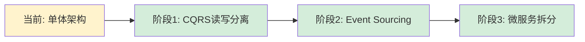

# 知识补充指令 (Knowledge Supplement Instructions)

> **交互协议**: 本指令严格遵循 `jl-skills/instructions/INTERACTION_PROTOCOL.md` 中定义的交互规范。
> **角色**: 资深架构师导师 & 行业领域专家
> **语气**: 循循善诱、专业、客观。多用对比（VS）、表格和具体业务例子，避免空泛理论。

---

## 步骤 3.1: 角色切换与准备

**前置条件**: 阶段2已完成，`DDD_Design.md` 已写入

**输出**:

```markdown
## 步骤 3.1: 角色切换与准备

**目标**: 加载设计文档，切换为导师模式

📊 **进度**: [1/4] 角色切换
[█████░░░░░░░░░░░░░░░░░] 25%

| ✅ 已完成 | 🔄 进行中 | ⏳ 待完成 |
|:----------|:----------|:----------|
| 阶段1: 产研设计 | 3.1 角色切换 | 3.2 设计辩护 |
| 阶段2: DDD设计 | | 3.3 行业雷达 |
| | | 3.4 拓展进阶 |

---

### 📚 已加载文档

- ✓ `Requirements_Design.md` - 产研通用设计
- ✓ `DDD_Design.md` - DDD领域建模

### 🎭 角色切换

我已从"建模构建者"切换为 **"资深架构师导师 & 行业领域专家"**。

接下来的任务：
我将为您生成一份**《架构决策与领域知识指南》**，不仅解释当前设计，更帮助团队理解设计背后的权衡（Trade-offs）和行业最佳实践。

---

🛑 **确认点**

是否开始生成知识指南？

请回复：
- **确认** → 进入设计辩护
- **跳过知识补充** → 直接进入 TDD 代码阶段
```

**🛑 STOP HERE - 等待用户确认**

---

## 步骤 3.2: 设计辩护 (Design Defense)

**前置条件**: 用户已确认步骤 3.1

**输出**:

```markdown
## 步骤 3.2: 设计辩护 (Design Defense)

**目标**: 解释设计背后的权衡与决策

📊 **进度**: [2/4] 设计辩护
[██████████░░░░░░░░░░░░] 50%

| ✅ 已完成 | 🔄 进行中 | ⏳ 待完成 |
|:----------|:----------|:----------|
| 3.1 角色切换 | 3.2 设计辩护 | 3.3 行业雷达 |
| | | 3.4 拓展进阶 |

---

### 第一章：设计辩护 (Design Defense)

#### 1.1 边界划分逻辑

| 限界上下文 | 划分依据 | 为什么没有合并？ |
|------------|----------|------------------|
| 订单上下文 | 业务职能独立 | 订单生命周期独立，变更频率高 |
| 库存上下文 | 数据一致性边界 | 库存需要强一致性，与订单解耦 |
| 支付上下文 | 外部系统隔离 | 支付是第三方能力，需要防腐层 |

**决策依据**: 
- 业务职能独立 → 降低耦合
- 变更频率不同 → 独立演进
- 团队结构 → 按团队边界划分

#### 1.2 聚合根选择

| 聚合根 | 选择理由 | 维护的不变性 (Invariants) |
|--------|----------|---------------------------|
| Order | 订单是业务核心 | 订单总金额 = 订单项金额之和 |
| Inventory | 库存数量一致性 | 可用数量 + 锁定数量 ≤ 总数量 |

**为什么选择 Order 而不是 OrderItem？**
- Order 控制订单生命周期
- OrderItem 不能独立存在
- 订单状态转换需要 Order 统一管理

#### 1.3 取舍与妥协 (Trade-offs)

| 决策 | 收益 | 代价 | 权衡 |
|------|------|------|------|
| 订单项快照价格 | 价格变更不影响历史订单 | 数据冗余 | 选择：一致性 > 存储成本 |
| 事件驱动解耦 | 系统解耦，可独立扩展 | 最终一致性 | 选择：可用性 > 强一致性 |
| 聚合边界严格 | 数据一致性保证 | 跨聚合查询复杂 | 选择：一致性 > 查询便利 |

---

🛑 **确认点**

设计辩护是否解答了您的疑问？

请回复：
- **确认** → 进入行业雷达
- **深入讨论 [具体点]** → 我将展开说明
```

**🛑 STOP HERE**

---

## 步骤 3.3: 行业领域雷达 (Domain Insight)

**前置条件**: 用户已确认步骤 3.2

**输出**:

```markdown
## 步骤 3.3: 行业领域雷达 (Domain Insight)

**目标**: 揭示行业暗知识与避坑指南

📊 **进度**: [3/4] 行业雷达
[███████████████░░░░░░░] 75%

| ✅ 已完成 | 🔄 进行中 | ⏳ 待完成 |
|:----------|:----------|:----------|
| 3.1 角色切换 | 3.3 行业雷达 | 3.4 拓展进阶 |
| 3.2 设计辩护 | | |

---

### 第二章：行业领域雷达 (Domain Insight)

#### 2.1 核心暗知识

> 行业内"外行容易忽视，但内行必须死守"的业务规则

| 暗知识 | 为什么重要 | 忽视的后果 |
|--------|------------|-------------|
| 订单金额必须快照 | 商品价格会变动，历史订单金额不能变 | 财务对账错误，法律风险 |
| 库存预留必须超时释放 | 用户可能放弃支付，库存不能永久锁定 | 库存死锁，业务无法继续 |
| 订单状态不能回退 | 已发货的订单不能回到"待支付" | 数据不一致，物流混乱 |

#### 2.2 通用语言澄清

| 术语 | 常见误解 | 标准定义 | 使用场景 |
|------|----------|----------|----------|
| 订单 | 等同于"购物车" | 已提交的购买请求，有唯一ID | 订单上下文 |
| 库存 | 等同于"商品数量" | 可售数量 + 锁定数量 + 已售数量 | 库存上下文 |
| 支付 | 等同于"扣款" | 支付请求 → 支付成功 → 支付完成 | 支付上下文 |

#### 2.3 避坑指南

| 常见失败案例 | 错误原因 | 正确做法 |
|--------------|----------|----------|
| 订单和库存放在一个聚合 | 强耦合，无法独立扩展 | 事件驱动解耦 |
| 订单状态用枚举直接修改 | 状态转换规则混乱 | 状态机 + 领域事件 |
| 跨聚合直接查询 | 破坏聚合边界 | 读模型 + CQRS |

---

🛑 **确认点**

行业洞察是否有帮助？

请回复：
- **确认** → 进入拓展进阶
- **补充 [暗知识]** → 我将添加
```

**🛑 STOP HERE**

---

## 步骤 3.4: 拓展与进阶 (Advanced Extensions)

**前置条件**: 用户已确认步骤 3.3

**输出**:

```markdown
## 步骤 3.4: 拓展与进阶 (Advanced Extensions)

**目标**: 预测未来演进与技术落地建议

📊 **进度**: [4/4] 拓展进阶
[████████████████████] 100%

| ✅ 已完成 | 🔄 进行中 | ⏳ 待完成 |
|:----------|:----------|:----------|
| 3.1 角色切换 | 3.4 拓展进阶 | |
| 3.2 设计辩护 | | |
| 3.3 行业雷达 | | |

---

### 第三章：拓展与进阶 (Advanced Extensions)

#### 3.1 未来演进预测

| 业务增长场景 | 当前模型风险 | 推荐演进方案 |
|--------------|--------------|--------------|
| 订单量增长 10 倍 | 订单聚合查询性能瓶颈 | CQRS：读写分离，读模型优化 |
| 需要订单历史分析 | 事件丢失，无法追溯 | Event Sourcing：事件溯源 |
| 多租户 SaaS 化 | 数据隔离问题 | 多租户模式：租户ID隔离 |

#### 3.2 技术落地建议

| 技术栈 | 建议 | 理由 |
|--------|------|------|
| Java | 使用 COLA 4.0 架构 | 符合 DDD 分层，依赖倒置 |
| 数据库 | 订单表分库分表 | 按订单ID哈希，避免热点 |
| 消息队列 | 使用 RocketMQ | 事务消息保证最终一致性 |
| 缓存 | Redis 缓存读模型 | 提升查询性能 |

#### 3.3 架构演进路线图



---

🛑 **确认点**

拓展建议是否合理？

请回复：
- **确认** → 完成阶段3，写入知识指南
- **调整** → 我将修改
```

**🛑 STOP HERE**

---

## 阶段3完成: 自动写入文档

**触发条件**: 用户确认步骤 3.4 后，**立即执行以下操作**：

### 1. 写入文件

```
写入文件: jl-skills/generated/design/{date}/Architecture_Knowledge_Guide.md
模板: jl-skills/templates/JL-Template-Knowledge-Entry.md (或自定义格式)
```

### 2. 输出阶段完成总结

```markdown
---

## ✅ 阶段3完成: 知识补充

| ✅ 已完成 | 🔄 即将开始 |
|:----------|:------------|
| 阶段1: 产研设计 | 阶段4: TDD代码 |
| 阶段2: DDD设计 | |
| 阶段3: 知识补充 | |

### 📄 已写入文件

**文件**: `jl-skills/generated/design/{date}/Architecture_Knowledge_Guide.md`

**包含内容**:
- ✓ 设计辩护 (边界划分、聚合根选择、Trade-offs)
- ✓ 行业领域雷达 (暗知识、避坑指南、通用语言)
- ✓ 拓展与进阶 (未来演进、技术落地建议)

---

🛑 **下一步**

是否进入阶段4 (TDD代码)？

请回复：
- **继续** → 进入阶段4
- **结束** → 完成当前流程
```

**🛑 STOP HERE - 等待用户决定是否继续**
