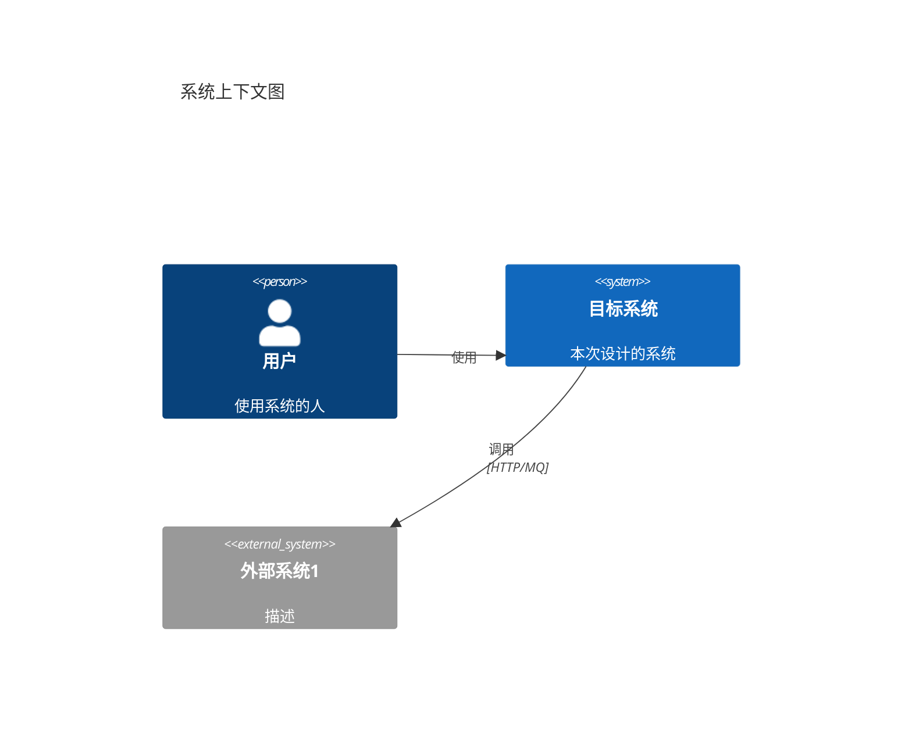

# 产研通用设计指令 (Requirements Design Instructions)

## ⚠️ 执行规则 (EXECUTION RULES)

```
🛑 CRITICAL: 
- 每个步骤输出后 MUST STOP
- 等待用户回复后才能继续
- 一次回复只输出一个步骤的内容
- 违反此规则将导致流程失败
```

**阶段1聚焦**: 理解业务需求，建立统一语言，梳理业务流程
**不包含**: 部署架构、监控告警、数据库设计（数据库在阶段2建模后推导）

---

## 步骤 1.1: 边界定义

**你必须输出以下内容，然后停止**:

```markdown
## 步骤 1.1: 边界定义

📊 **进度**: [1/7] 边界定义
[██░░░░░░░░░░░░░░░░░░] 14%

| ✅ 已完成 | 🔄 进行中 | ⏳ 待完成 |
|:----------|:----------|:----------|
| | 1.边界定义 | 2.数据字典 |
| | | 3.业务流程 |
| | | 4.功能清单 |
| | | 5.用户故事 |
| | | 6.业务规则 |
| | | 7.系统上下文 |

---

### 基本信息

| 项目 | 内容 |
|------|------|
| **业务背景** | [根据需求填写] |
| **核心诉求** | [动词+对象+目标] |

### 边界定义

| 类型 | 内容 |
|------|------|
| **In-Scope** | - [必须实现1]<br>- [必须实现2] |
| **Out-of-Scope** | - [不做1]<br>- [不做2] |

### 依赖条件

| 依赖项 | 类型 | 状态 |
|--------|------|------|
| [依赖1] | 内部/外部/第三方 | 已对接/待对接 |

### 利益攸关者

| 角色 | 职责 | 诉求 |
|------|------|------|
| [角色1] | [职责] | [诉求] |

---

🛑 **确认点**

边界定义是否准确？

请回复：
- **确认** → 进入数据字典
- **修改 [具体内容]** → 我将调整
```

**🛑 STOP HERE - DO NOT OUTPUT STEP 1.2 UNTIL USER CONFIRMS**

---

## 步骤 1.2: 数据字典

**前置条件**: 用户已确认步骤 1.1

```markdown
## 步骤 1.2: 数据字典

📊 **进度**: [2/7] 数据字典
[████░░░░░░░░░░░░░░░░] 28%

| ✅ 已完成 | 🔄 进行中 | ⏳ 待完成 |
|:----------|:----------|:----------|
| 1.边界定义 | 2.数据字典 | 3.业务流程 |
| | | 4.功能清单 |
| | | 5.用户故事 |
| | | 6.业务规则 |
| | | 7.系统上下文 |

---

### 数据字典 (统一语言)

> DDD 核心：业务和技术使用相同术语

| 术语 | 含义 | 属性/字段 | 备注 |
|------|------|-----------|------|
| [术语1] | [含义] | [属性] | [备注] |

---

🛑 **确认点**

术语定义是否准确？是否有遗漏？

请回复：
- **确认** → 进入业务流程
- **补充 [术语]** → 我将添加
```

**🛑 STOP HERE**

---

## 步骤 1.3: 业务流程

**前置条件**: 用户已确认步骤 1.2

```markdown
## 步骤 1.3: 业务流程

📊 **进度**: [3/7] 业务流程
[██████░░░░░░░░░░░░░░] 42%

| ✅ 已完成 | 🔄 进行中 | ⏳ 待完成 |
|:----------|:----------|:----------|
| 1.边界定义 | 3.业务流程 | 4.功能清单 |
| 2.数据字典 | | 5.用户故事 |
| | | 6.业务规则 |
| | | 7.系统上下文 |

---

### 主业务流程图

```mermaid
flowchart TD
    [根据需求绘制流程图]
```

### 主业务时序图

```mermaid
sequenceDiagram
    [根据需求绘制时序图]
```

### 分支流程

| 分支名称 | 触发条件 | 流程描述 |
|----------|----------|----------|
| [分支1] | [条件] | [描述] |

---

🛑 **确认点**

业务流程是否完整？图表逻辑是否正确？

请回复：
- **确认** → 进入功能清单
- **补充分支** → 我将添加
```

**🛑 STOP HERE**

---

## 步骤 1.4: 功能清单

**前置条件**: 用户已确认步骤 1.3

```markdown
## 步骤 1.4: 功能清单

📊 **进度**: [4/7] 功能清单
[████████░░░░░░░░░░░░] 57%

| ✅ 已完成 | 🔄 进行中 | ⏳ 待完成 |
|:----------|:----------|:----------|
| 1.边界定义 | 4.功能清单 | 5.用户故事 |
| 2.数据字典 | | 6.业务规则 |
| 3.业务流程 | | 7.系统上下文 |

---

### 功能清单

| 模块 | 功能点 | 依赖条件 | 对外能力 | 关联规则 |
|------|--------|----------|----------|----------|
| [模块1] | [功能] | [依赖] | POST/GET [路径] | BR-XXX |

---

🛑 **确认点**

功能清单是否完整？

请回复：
- **确认** → 进入用户故事
- **补充功能** → 我将添加
```

**🛑 STOP HERE**

---

## 步骤 1.5: 用户故事

**前置条件**: 用户已确认步骤 1.4

```markdown
## 步骤 1.5: 用户故事

📊 **进度**: [5/7] 用户故事
[██████████░░░░░░░░░░] 71%

| ✅ 已完成 | 🔄 进行中 | ⏳ 待完成 |
|:----------|:----------|:----------|
| 1.边界定义 | 5.用户故事 | 6.业务规则 |
| 2.数据字典 | | 7.系统上下文 |
| 3.业务流程 | | |
| 4.功能清单 | | |

---

### 用户故事

| 用户类型 | 用户故事 | 验收标准 |
|----------|----------|----------|
| [角色] | 作为[角色]，我想要[做什么]，以便[目的] | 1. [标准1]<br>2. [标准2] |

---

🛑 **确认点**

用户故事是否完整？验收标准是否清晰？

请回复：
- **确认** → 进入业务规则
- **补充故事** → 我将添加
```

**🛑 STOP HERE**

---

## 步骤 1.6: 业务规则

**前置条件**: 用户已确认步骤 1.5

```markdown
## 步骤 1.6: 业务规则

📊 **进度**: [6/7] 业务规则
[████████████░░░░░░░░] 85%

| ✅ 已完成 | 🔄 进行中 | ⏳ 待完成 |
|:----------|:----------|:----------|
| 1.边界定义 | 6.业务规则 | 7.系统上下文 |
| 2.数据字典 | | |
| 3.业务流程 | | |
| 4.功能清单 | | |
| 5.用户故事 | | |

---

### 业务规则

| 规则ID | 相关功能 | 规则名称 | 描述 | 约束强度 |
|--------|----------|----------|------|----------|
| BR-001 | [功能] | [名称] | [描述] | 强制/建议 |

---

🛑 **确认点**

业务规则是否完整？

请回复：
- **确认** → 进入系统上下文
- **补充规则** → 我将添加
```

**🛑 STOP HERE**

---

## 步骤 1.7: 系统上下文

**前置条件**: 用户已确认步骤 1.6

```markdown
## 步骤 1.7: 系统上下文

📊 **进度**: [7/7] 系统上下文
[████████████████████] 100%

| ✅ 已完成 | 🔄 进行中 | ⏳ 待完成 |
|:----------|:----------|:----------|
| 1.边界定义 | 7.系统上下文 | |
| 2.数据字典 | | |
| 3.业务流程 | | |
| 4.功能清单 | | |
| 5.用户故事 | | |
| 6.业务规则 | | |

---

### C4 Context Diagram

> 系统与外部用户、外部系统的关系（不涉及内部部署）



### 外部依赖清单

| 外部系统 | 用途 | 交互方式 | 状态 |
|----------|------|----------|------|
| [系统1] | [用途] | HTTP/MQ | 已对接/待对接 |

---

🛑 **确认点**

系统上下文是否准确？外部依赖是否完整？

请回复：
- **确认** → 完成阶段1，写入文档
- **调整** → 我将修改
```

**🛑 STOP HERE**

---

## 阶段1完成: 自动写入文档

**触发条件**: 用户确认步骤 1.7 后，**立即执行以下操作**：

### 1. 写入文件

```
写入文件: jl-skills/generated/design/{date}/Requirements_Design.md
模板: jl-skills/templates/JL-Template-Requirements-Design.md
```

### 2. 输出阶段完成总结

```markdown
---

## ✅ 阶段1完成: 产研通用设计

| ✅ 已完成 | 🔄 即将开始 |
|:----------|:------------|
| 阶段1: 产研设计 | 阶段2: DDD设计 |

### 📄 已写入文件

**文件**: `jl-skills/generated/design/{date}/Requirements_Design.md`

**包含内容**:
- ✓ 边界定义
- ✓ 数据字典
- ✓ 业务流程
- ✓ 功能清单
- ✓ 用户故事
- ✓ 业务规则
- ✓ 系统上下文

---

🛑 **下一步**

是否进入阶段2 (DDD设计)？

请回复：
- **继续** → 进入阶段2
- **结束** → 完成当前流程
```

**🛑 STOP HERE - 等待用户决定是否继续**
