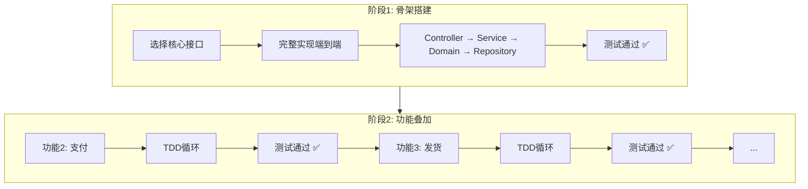
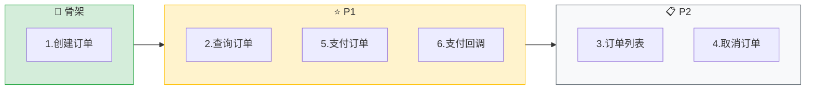
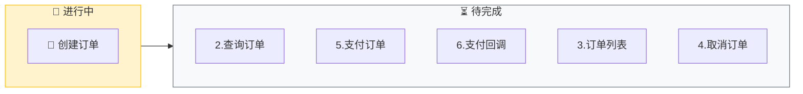
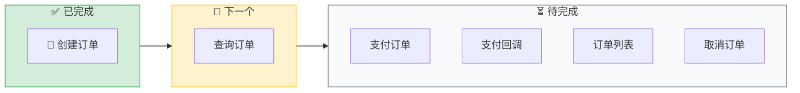

# TDD+BDD 实现指令 (TDD Implementation Instructions)

> **交互协议**: 本指令遵循 `jl-skills/instructions/INTERACTION_PROTOCOL.md` 中定义的交互规范。
> **执行策略**: Walking Skeleton - 先完整实现一个核心接口，再逐个叠加其他功能。
> **测试方法命名规范**: 参考 `jl-skills/specs/Java编码规范.md` - 方法名全英文下划线命名，中文意图使用 `@DisplayName("")` 注解。

---

## 核心策略: Walking Skeleton (行走骨架)

> **原则**: 对于复杂需求（多个功能/接口），不要试图一次实现所有功能。
> 先选择一个**核心接口**，完整走通**端到端**的所有层，形成骨架。
> 然后以此为基础，逐个叠加其他功能。



---

## 执行原则

1. **先骨架后叠加**: 第一个功能必须打通所有层，形成可运行的骨架
2. **BDD 先行**: 每个功能先定义 Given-When-Then 验收标准
3. **TDD 循环**: 🔴 红 → 👤 用户确认红灯 → 🟢 绿 → 👤 用户确认绿灯 → 重构
4. **用户执行测试**: **必须等待用户执行测试并确认结果**（红灯/绿灯）
5. **逐个确认**: 每个功能完成后等待用户确认，再进入下一个
6. **增量交付**: 每完成一个功能就写入代码文件

## ⚠️ 代码输出规则 (CRITICAL)

```
📤 对话框输出:
- BDD 验收标准（Gherkin）
- 文件列表预览
- 测试执行提示（要求用户执行测试）

📁 直接写入文件（不打印代码内容）:
- 测试代码（🔴 Red 阶段）- 用户需要执行测试确认红灯
- 实现代码（🟢 Green 阶段）- 用户需要执行测试确认绿灯
```

**规则**:
- **BDD 验收标准**: 打印到对话框，等待用户确认
- **测试代码**: **直接写入文件**，不打印代码内容，只显示文件列表
- **测试方法命名规范（强制）**:
    - **方法名**: 全英文，下划线命名，格式：`test_{methodName}_{condition}_{expectedResult}`
    - **中文意图**: 使用 `@DisplayName("中文描述")` 注解
    - **参考**: `jl-skills/specs/Java编码规范.md` 中的单元测试命名规范
- **用户执行测试（红灯）**: **必须等待用户执行测试并确认 🔴 红灯**（TDD 核心原则）
- **实现代码**: **直接写入文件**，不打印代码内容，只显示文件列表
- **用户执行测试（绿灯）**: **必须等待用户执行测试并确认 🟢 绿灯**（确保实现正确）

---

## Step 1: 功能拆分与优先级排序

**目标**: 识别所有功能接口，选择核心骨架接口

**输出**:

````markdown
## Step 1: 功能拆分与优先级

📊 **阶段3进度**: [1/N] 功能规划

---

### 功能接口清单

根据需求分析，识别以下功能接口：

| 序号 | 接口名称 | HTTP Method | 路径 | 优先级 | 说明 |
|------|----------|-------------|------|--------|------|
| 1 | 创建订单 | POST | /orders | ⭐ 骨架 | **核心接口，先实现** |
| 2 | 查询订单 | GET | /orders/{id} | P1 | |
| 3 | 订单列表 | GET | /orders | P2 | |
| 4 | 取消订单 | PUT | /orders/{id}/cancel | P2 | |
| 5 | 支付订单 | POST | /payments | P1 | |
| 6 | 支付回调 | POST | /payments/callback | P1 | |

### 骨架接口选择

**选择**: `POST /orders` (创建订单)

**选择原因**:
- 涉及核心领域模型 (Order, OrderItem)
- 包含完整的业务规则校验
- 需要跨服务调用 (库存服务)
- 能打通所有架构层

### 实现计划



---

📋 **确认检查点**

- 回复 **确认** → 开始实现骨架接口
- 回复 **调整优先级** → 我将重新排序
- 回复 **更换骨架** → 我将选择其他接口作为骨架

**请确认：** 功能拆分和优先级是否合理？
````

**[等待用户确认]**

---

## Step 2: 生成 COLA 目录结构

**输出**:

````markdown
## Step 2: COLA 目录结构

📊 **进度**: [2/N] 目录结构

---

### 项目目录结构

```
src/main/java/com/example/order/
├── adapter/                    # 适配器层（入口）
│   ├── web/                   # REST Controller
│   │   └── OrderController.java
│   └── gateway/               # 外部服务适配
│       └── PaymentGatewayAdapter.java
│
├── app/                       # 应用层（用例编排）
│   ├── command/               # 写操作
│   │   ├── CreateOrderCommand.java
│   │   └── OrderCommandService.java
│   └── query/                 # 读操作
│       └── OrderQueryService.java
│
├── client/                    # 对外API定义
│   └── dto/
│       ├── OrderDTO.java
│       └── CreateOrderRequest.java
│
├── domain/                    # 领域层（核心业务）
│   ├── entity/                # 聚合根、实体
│   │   ├── Order.java         # 聚合根
│   │   └── OrderItem.java     # 实体
│   ├── valueobject/           # 值对象
│   │   ├── OrderId.java
│   │   ├── Money.java
│   │   └── OrderStatus.java
│   ├── service/               # 领域服务
│   │   └── OrderDomainService.java
│   ├── event/                 # 领域事件
│   │   └── OrderCreatedEvent.java
│   └── repository/            # 仓储接口
│       └── OrderRepository.java
│
└── infrastructure/            # 基础设施层（技术实现）
    ├── repository/            # 仓储实现
    │   └── OrderRepositoryImpl.java
    ├── gateway/               # 外部服务实现
    │   └── PaymentGatewayImpl.java
    └── config/                # 配置
        └── DomainConfig.java
```

---

📋 **确认检查点**

- 回复 **确认** → 开始实现骨架接口
- 回复 **调整** → 我将修改结构

**请确认：** 目录结构是否符合您的项目规范？
````

**[等待用户确认]**

---

## Step 3: 骨架接口 - 端到端实现

> **重点**: 这是第一个功能，必须打通所有层！

### 3.1 BDD 验收标准

**输出**:

````markdown
## 🦴 骨架接口: 创建订单 (POST /orders)

📊 **进度**: [1/6] 创建订单



---

### 📋 BDD 验收标准 (Given-When-Then)

```gherkin
Feature: 创建订单
  作为 买家
  我想要 创建订单
  以便 购买商品

  Background:
    Given 系统中存在商品 "iPhone 15" 单价 7999 元，库存 100
    And 用户 "张三" 已登录

  Scenario: 正常创建订单
    Given 购物车中有 2 件 "iPhone 15"
    When 用户调用 POST /orders 接口
    Then HTTP 状态码为 201
    And 响应体包含订单ID
    And 订单状态为 "CREATED"
    And 订单总金额为 15998 元

  Scenario: 库存不足时创建订单失败
    Given 购物车中有 200 件 "iPhone 15"
    When 用户调用 POST /orders 接口
    Then HTTP 状态码为 400
    And 错误信息为 "库存不足"

  Scenario: 购物车为空时创建订单失败
    Given 购物车为空
    When 用户调用 POST /orders 接口
    Then HTTP 状态码为 400
    And 错误信息为 "购物车不能为空"
```

---

📋 **确认检查点**

- 回复 **确认** → 进入红灯测试
- 回复 **补充场景** → 我将添加
- 回复 **调整** → 我将修改

**请确认：** 验收标准是否正确？
````

**[等待用户确认]**

---

### 3.2 🔴 Red - 编写失败的测试 (端到端)

**输出**:

````markdown
### 🔴 Red - 失败的测试 (端到端)

**目标**: 编写覆盖**所有层**的测试

---

### 即将生成的测试文件

| 层 | 测试文件 | 路径 |
|----|----------|------|
| Controller | OrderControllerIntegrationTest.java | `test/.../OrderControllerIntegrationTest.java` |
| Service | OrderCommandServiceTest.java | `test/.../OrderCommandServiceTest.java` |
| Domain | OrderTest.java | `test/.../OrderTest.java` |

**测试覆盖**:
- ✅ Controller 层集成测试（MockMvc）
- ✅ Service 层单元测试（Mockito）
- ✅ Domain 层单元测试（纯 Java）

**预期状态**: 🔴 编译失败（类和方法尚未实现）

---

📋 **确认检查点**

- 回复 **确认** → **立即写入所有测试文件**（不打印代码内容）
- 回复 **调整** → 我将修改测试

**请确认：** 是否开始生成测试代码？
````

**[等待用户确认]**

---

### 3.2.1 Red 完成 - 自动写入测试文件

**触发条件**: 用户确认步骤 3.2 后，**立即执行以下操作**：

### 1. 直接写入所有测试文件

```
⚠️ 重要：测试代码直接写入文件，不打印到对话框

写入以下测试文件：
- test/.../OrderControllerIntegrationTest.java
- test/.../OrderCommandServiceTest.java
- test/.../OrderTest.java

⚠️ 测试方法命名规范（强制）:
- 方法名: 全英文，下划线命名，格式：test_{methodName}_{condition}_{expectedResult}
- 中文意图: 使用 @DisplayName("中文描述") 注解
- **TDD 阶段标识（强制）**: 在 TDD 环节，@DisplayName 开头必须加上 emoji：
  - 🔴 红灯阶段（Red）: @DisplayName("🔴 正常流程：...") - 测试应该失败
  - 🟢 绿灯阶段（Green）: @DisplayName("🟢 正常流程：...") - 测试应该通过
- 示例: 
  - 🔴 Red 阶段: test_createOrder_validInput_shouldReturnSuccess() + @DisplayName("🔴 正常流程：有效输入应返回成功")
  - 🟢 Green 阶段: test_createOrder_validInput_shouldReturnSuccess() + @DisplayName("🟢 正常流程：有效输入应返回成功")
  - 异常流程: test_createOrder_emptyCart_shouldThrowException() + @DisplayName("🔴 异常流程：购物车为空应抛出异常")
```

### 2. 输出完成总结并要求用户执行测试

````markdown
### ✅ 测试代码已写入

**测试文件**:

| 层 | 测试文件 | 路径 |
|----|----------|------|
| Controller | OrderControllerIntegrationTest.java | `test/.../OrderControllerIntegrationTest.java` |
| Service | OrderCommandServiceTest.java | `test/.../OrderCommandServiceTest.java` |
| Domain | OrderTest.java | `test/.../OrderTest.java` |

---

🛑 **TDD 关键步骤：确认红灯**

请执行以下操作：

1. **运行测试**:
   ```bash
   mvn test
   # 或
   ./gradlew test
   ```

2. **确认测试失败**:
    - ✅ 编译错误（类不存在、方法不存在）
    - ✅ 测试断言失败
    - ✅ 这是预期的 🔴 红灯状态

3. **检查语法问题**:
    - 如果测试代码有**语法错误**（编译不通过），请告诉我具体错误
    - 如果测试代码有**逻辑问题**，请告诉我需要调整的地方
    - 如果测试代码**编译通过但测试通过**，说明测试无效，需要调整

---

📋 **确认检查点**

- 回复 **红灯确认** → 测试已执行，确认失败（🔴 红灯），进入 🟢 Green 阶段
- 回复 **语法错误: [具体错误信息]** → 我将修复测试代码的语法问题
- 回复 **调整测试: [具体说明]** → 我将修改测试逻辑
- 回复 **测试通过了** → 说明测试无效，我将调整测试使其失败

**请确认：** 测试是否已执行并确认失败（🔴 红灯）？
````

**🛑 STOP HERE - 等待用户执行测试并确认红灯**

---

### 3.2.2 处理语法错误（如需要）

**触发条件**: 用户回复 `语法错误: [具体错误信息]` 或 `调整测试: [具体说明]`

**处理流程**:
1. 读取用户报告的语法错误或调整需求
2. 修复测试代码
3. **重新写入测试文件**（覆盖原文件）
4. 输出修复说明，**再次要求用户执行测试确认红灯**

**输出模板**:

````markdown
### 🔧 测试代码已修复

**修复内容**:
- [具体修复的语法错误或逻辑调整]

**测试文件已更新**:
- `test/.../OrderControllerIntegrationTest.java`
- `test/.../OrderCommandServiceTest.java`
- `test/.../OrderTest.java`

---

🛑 **请再次执行测试确认红灯**

请运行测试，确认：
- ✅ 编译通过（无语法错误）
- ✅ 测试失败（🔴 红灯）

**请确认：** 测试是否已执行并确认失败（🔴 红灯）？
````

**🛑 STOP HERE - 等待用户再次确认红灯**

---

### 3.3 🟢 Green - 端到端最小实现

**前置条件**:
- ✅ 测试文件已在步骤 3.2.1 写入
- ✅ 用户已执行测试并确认 🔴 红灯（测试失败）

**输出**:

````markdown
### 🟢 Green - 端到端最小实现

**目标**: 让所有测试通过，打通 Controller → Service → Domain → Repository

**当前状态**: ✅ 用户已确认 🔴 红灯（测试失败）

---

### 即将生成的实现代码文件

| 层 | 文件 | 路径 |
|----|------|------|
| Adapter | OrderController.java | `adapter/web/OrderController.java` |
| App | OrderCommandService.java | `app/command/OrderCommandService.java` |
| App | CreateOrderCommand.java | `app/command/CreateOrderCommand.java` |
| Domain | Order.java | `domain/entity/Order.java` |
| Domain | OrderItem.java | `domain/entity/OrderItem.java` |
| Domain | OrderId.java | `domain/valueobject/OrderId.java` |
| Domain | OrderStatus.java | `domain/valueobject/OrderStatus.java` |
| Domain | OrderRepository.java | `domain/repository/OrderRepository.java` |
| Infra | OrderRepositoryImpl.java | `infrastructure/repository/OrderRepositoryImpl.java` |

**实现说明**:
- Controller 层：接收请求，调用 Service
- Service 层：编排领域服务，处理事务
- Domain 层：聚合根、实体、值对象（贫血模型）
- Infrastructure 层：Repository 实现

**预期结果**: 🟢 测试通过

---

📋 **确认检查点**

- 回复 **确认** → **立即写入所有实现代码文件**（不打印到对话框）
- 回复 **调整** → 我将修改实现

**请确认：** 是否开始生成实现代码？
````

**[等待用户确认]**

---

### 3.4 骨架完成 - 自动写入文件

**触发条件**: 用户确认步骤 3.3 后，**立即执行以下操作**：

### 1. 直接写入所有实现代码文件

```
⚠️ 重要：实现代码直接写入文件，不打印到对话框

写入以下实现文件（测试文件已在步骤3.2.1写入）：
- adapter/web/OrderController.java
- app/command/OrderCommandService.java
- app/command/CreateOrderCommand.java
- domain/entity/Order.java
- domain/entity/OrderItem.java
- domain/valueobject/OrderId.java
- domain/valueobject/OrderStatus.java
- domain/repository/OrderRepository.java
- infrastructure/repository/OrderRepositoryImpl.java
```

### 2. 输出完成总结并要求用户执行测试

````markdown
### ✅ 实现代码已写入

**代码文件**:

| 层 | 文件 | 路径 |
|----|------|------|
| Adapter | OrderController.java | `adapter/web/OrderController.java` |
| App | OrderCommandService.java | `app/command/OrderCommandService.java` |
| App | CreateOrderCommand.java | `app/command/CreateOrderCommand.java` |
| Domain | Order.java | `domain/entity/Order.java` |
| Domain | OrderItem.java | `domain/entity/OrderItem.java` |
| Domain | OrderId.java | `domain/valueobject/OrderId.java` |
| Domain | OrderStatus.java | `domain/valueobject/OrderStatus.java` |
| Domain | OrderRepository.java | `domain/repository/OrderRepository.java` |
| Infra | OrderRepositoryImpl.java | `infrastructure/repository/OrderRepositoryImpl.java` |
| Test | OrderControllerIntegrationTest.java | `test/.../OrderControllerIntegrationTest.java` |
| Test | OrderCommandServiceTest.java | `test/.../OrderCommandServiceTest.java` |
| Test | OrderTest.java | `test/.../OrderTest.java` |

---

🛑 **TDD 关键步骤：确认绿灯**

请执行以下操作：

1. **运行测试**:
   ```bash
   mvn test
   # 或
   ./gradlew test
   ```

2. **确认测试通过**:
    - ✅ 所有测试通过
    - ✅ 这是预期的 🟢 绿灯状态

3. **如果测试失败**:
    - 请告诉我具体的失败信息，我将修复实现代码
    - 如果实现逻辑需要调整，请告诉我

---

📋 **确认检查点**

- 回复 **绿灯确认** → 测试已执行，确认通过（🟢 绿灯），骨架完成
- 回复 **测试失败: [具体错误信息]** → 我将修复实现代码
- 回复 **调整实现: [具体说明]** → 我将修改实现逻辑

**请确认：** 测试是否已执行并确认通过（🟢 绿灯）？
````

**🛑 STOP HERE - 等待用户执行测试并确认绿灯**

---

### 3.4.1 处理测试失败（如需要）

**触发条件**: 用户回复 `测试失败: [具体错误信息]` 或 `调整实现: [具体说明]`

**处理流程**:
1. 读取用户报告的错误或调整需求
2. 修复实现代码
3. **重新写入实现文件**（覆盖原文件）
4. 输出修复说明，**再次要求用户执行测试确认绿灯**

**输出模板**:

````markdown
### 🔧 实现代码已修复

**修复内容**:
- [具体修复的错误或逻辑调整]

**代码文件已更新**:
- [更新的文件列表]

---

🛑 **请再次执行测试确认绿灯**

请运行测试，确认：
- ✅ 所有测试通过（🟢 绿灯）

**请确认：** 测试是否已执行并确认通过（🟢 绿灯）？
````

**🛑 STOP HERE - 等待用户再次确认绿灯**

---

### 3.5 骨架完成总结

**触发条件**: 用户确认 🟢 绿灯后

**输出**:

````markdown
### 🦴 骨架已搭建完成！

现在我们有了一个可运行的端到端骨架，后续功能将在此基础上**叠加**。



---

**下一个功能**: 查询订单 (GET /orders/{id})

**继续吗？** [继续/暂停]
````

**[等待用户确认]**

---

## Step 4: 叠加功能 - 重复 TDD 循环

> 对每个后续功能，重复以下流程：
> 1. BDD 验收标准 → 确认（打印到对话框）
> 2. 🔴 Red 测试 → 确认 → **直接写入测试文件**（不打印代码）
> 3. **用户执行测试** → **确认红灯**（测试失败）
> 4. 🟢 Green 实现 → 确认 → **直接写入实现文件**（不打印代码）
> 5. **用户执行测试** → **确认绿灯**（测试通过）
> 6. 输出完成总结 → 进入下一个

**⚠️ 重要规则**:
- **BDD 验收标准**: 打印到对话框，等待确认
- **测试代码**: **直接写入文件，不打印代码内容**
- **用户执行测试（红灯）**: **必须等待用户执行测试并确认 🔴 红灯**
- **实现代码**: **直接写入文件，不打印代码内容**
- **用户执行测试（绿灯）**: **必须等待用户执行测试并确认 🟢 绿灯**

### 示例: 功能2 - 查询订单

````markdown
## 功能2: 查询订单 (GET /orders/{id})

📊 **进度**: [2/6] 查询订单

---

### 📋 BDD 验收标准

```gherkin
Feature: 查询订单
  Scenario: 正常查询订单
    Given 存在订单 "ORD-001"
    When 调用 GET /orders/ORD-001
    Then HTTP 状态码为 200
    And 返回订单详情

  Scenario: 订单不存在
    When 调用 GET /orders/NOT-EXIST
    Then HTTP 状态码为 404
    And 错误信息为 "订单不存在"
```

---

📋 **确认检查点**

**请确认：** 验收标准是否正确？
````

**[等待用户确认]**

---

## 循环规则总结

```
1. 骨架接口 (端到端完整实现)
   └── BDD (打印) → 🔴 (写入测试文件) → 👤 用户执行确认红灯 → 🟢 (写入实现文件) → 👤 用户执行确认绿灯 → ✅ 完成
   
2. 功能2 (叠加)
   └── BDD (打印) → 🔴 (写入测试文件) → 👤 用户执行确认红灯 → 🟢 (写入实现文件) → 👤 用户执行确认绿灯 → ✅ 完成
   
3. 功能3 (叠加)
   └── BDD (打印) → 🔴 (写入测试文件) → 👤 用户执行确认红灯 → 🟢 (写入实现文件) → 👤 用户执行确认绿灯 → ✅ 完成
   
... 重复直到所有功能完成
```

**关键点**:
- 每个功能独立确认，不跳步
- 骨架打通后，后续功能复用已有结构
- **BDD 验收标准**: 打印到对话框，等待确认
- **测试代码**: **直接写入文件，不打印代码内容**
- **用户执行测试（红灯）**: **必须等待用户执行测试并确认 🔴 红灯**（TDD 核心原则）
- **实现代码**: **直接写入文件，不打印代码内容**
- **用户执行测试（绿灯）**: **必须等待用户执行测试并确认 🟢 绿灯**（确保实现正确）
- 每完成一个功能就写入代码，实现增量交付

**TDD 核心原则**:
> 1. **红灯确认**: 只有确认测试真的失败了（红灯），才能写实现代码。这确保测试是有效的，而不是"假测试"。
> 2. **绿灯确认**: 只有确认测试真的通过了（绿灯），才能认为功能完成。这确保实现是正确的。
