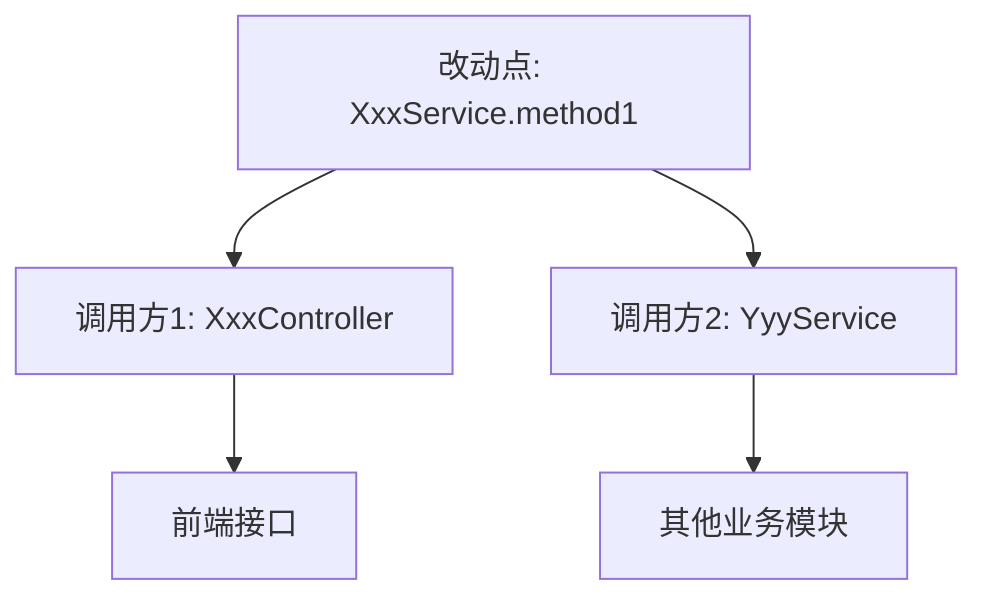

# 需求分析与变更分析指令 (Requirement Analysis & Change Analysis Instructions)

## ⚠️ 执行规则 (EXECUTION RULES)

```
🛑 CRITICAL: 
- 每个步骤输出后 MUST STOP
- 等待用户回复后才能继续
- 一次回复只输出一个步骤的内容
- 违反此规则将导致流程失败
```

此文档指导 Agent 执行快速改动流程的**阶段 1: 需求明确与变更分析**。

> [!IMPORTANT]
> **目标**: 明确改动需求，分析代码变更位置和影响范围，生成变更分析报告。
> **原则**: 快速、准确、聚焦改动点。

---

## 步骤 1.1: 需求理解与总结

**你必须输出以下内容，然后停止**:

### 1.1.1 解析用户输入

**输入来源**:
- 用户提供的需求描述
- （可选）用户指定的文件或模块

**分析内容**:
1. **提取关键信息**:
   - 改动目标（修复什么、新增什么、调整什么）
   - 改动范围（涉及哪些模块、文件）
   - 改动原因（Bug、优化、新需求）

2. **识别改动类型**:
   - **修改已有功能**: 需要先补充单元测试
   - **新增小功能**: 直接编写新代码和测试
   - **Bug 修复**: 需要先补充测试用例覆盖问题场景

### 1.1.2 输出需求总结

**输出格式**:

````markdown
## 步骤 1.1: 需求总结

📊 **进度**: [1/2] 需求明确与变更分析
[████░░░░░░░░░░░░░░░░] 17%

| ✅ 已完成 | 🔄 进行中 | ⏳ 待完成 |
|:----------|:----------|:----------|
| | 1.1.需求总结 | 1.2.变更分析 |
| | | 2.单元测试补充 |
| | | 3.代码修改 |
| | | 4.测试验证 |
| | | 5.生命周期提示 |

---

### 需求总结

**改动需求**: [详细描述改动需求]

**改动类型**: [修改已有功能/新增小功能/Bug修复]

**涉及模块**: 
- [模块1]
- [模块2]

**预期结果**: [改动后的预期行为]

---

🛑 **确认点**

需求理解是否准确？

- 回复 **确认** → 进入变更分析
- 回复 **补充: [内容]** → 我将补充需求
- 回复 **调整: [内容]** → 我将调整需求理解

**请确认：** 需求理解是否正确？
````

**🛑 STOP HERE - DO NOT OUTPUT STEP 1.2 UNTIL USER CONFIRMS**

⚠️ **重要**: 用户未回复"确认"前，禁止执行任何后续步骤，禁止输出步骤1.2的内容。

---

## 步骤 1.2: 代码变更分析

**你必须输出以下内容，然后停止**:

### 1.2.1 分析代码结构

**分析方式**:
1. **如果用户指定了文件**: 直接分析指定文件
2. **如果用户未指定**: 根据需求描述，搜索相关代码文件

**分析内容**:
1. **识别需要修改的文件**:
   - 直接修改的文件（Service、Controller、Entity 等）
   - 间接影响的文件（依赖的类、配置等）

2. **识别修改类型**:
   - 修改方法逻辑
   - 新增方法
   - 修改类结构
   - 修改配置

3. **分析影响范围**:
   - 调用链分析（哪些地方调用了要修改的方法）
   - 依赖关系（修改会影响哪些其他模块）
   - 数据流影响（数据库、缓存、消息队列等）

### 1.2.2 生成变更分析报告

**输出格式**:

````markdown
## 步骤 1.2: 代码变更分析

📊 **进度**: [2/2] 需求明确与变更分析
[████░░░░░░░░░░░░░░░░] 17%

| ✅ 已完成 | 🔄 进行中 | ⏳ 待完成 |
|:----------|:----------|:----------|
| 1.1.需求总结 | 1.2.变更分析 | 2.单元测试补充 |
| | | 3.代码修改 |
| | | 4.测试验证 |
| | | 5.生命周期提示 |

---

### 需要修改的文件

| 文件路径 | 修改类型 | 修改内容 | 影响范围 |
|---------|---------|---------|---------|
| `src/main/java/.../XxxService.java` | 修改方法 | `method1()` 方法逻辑调整 | Service 层 |
| `src/main/java/.../XxxController.java` | 新增方法 | 新增 `createXxx()` 接口 | Controller 层 |
| `src/main/java/.../XxxEntity.java` | 修改字段 | 新增 `status` 字段 | Entity 层 |

---

### 影响分析

**调用链分析**:



**依赖关系**:

| 被影响模块 | 影响类型 | 风险等级 |
|-----------|---------|---------|
| OrderService | 方法签名变更 | ⚠️ 高风险 |
| PaymentService | 数据格式变更 | ✅ 低风险 |

**数据流影响**:

- 数据库: 需要修改表结构（如需要）
- 缓存: 需要清理相关缓存（如需要）
- 消息队列: 无影响

---

### 风险评估

| 风险项 | 风险等级 | 影响范围 | 缓解措施 |
|--------|---------|---------|---------|
| 方法签名变更 | ⚠️ 高风险 | 多个调用方 | 先补充单元测试，确保兼容性 |
| 数据格式变更 | ✅ 低风险 | 单个模块 | 直接修改 |

---

📋 **确认检查点**

变更分析是否准确？

- 回复 **确认** → 进入单元测试补充阶段（如需要）
- 回复 **补充文件: [文件路径]** → 我将添加文件到分析
- 回复 **调整分析** → 我将重新分析

**请确认：** 变更分析是否正确？
````

**🛑 STOP HERE - 等待用户确认**

---

## 阶段 1 完成: 自动写入报告

**触发条件**: 用户确认步骤 1.2 后，**立即执行**：

### 1. 写入变更分析报告

```
写入文件: jl-skills/generated/quick-fix/{date}/Change_Analysis_Report.md
```

**报告内容**:
- 需求总结
- 改动类型
- 需要修改的文件清单
- 影响分析（调用链、依赖关系、数据流）
- 风险评估

### 2. 输出阶段完成总结

````markdown
---

## ✅ 阶段 1 完成

| ✅ 已完成 | 🔄 即将开始 |
|:----------|:------------|
| 阶段1: 需求明确与变更分析 | 阶段2: 单元测试补充（如需要） |

### 📄 已写入文件

**文件**: `jl-skills/generated/quick-fix/{date}/Change_Analysis_Report.md`

**包含内容**:
- ✓ 需求总结
- ✓ 改动类型
- ✓ 需要修改的文件清单
- ✓ 影响分析
- ✓ 风险评估

---

🛑 **下一步**

根据改动类型，下一步将：
- **修改已有功能/Bug修复** → 进入阶段2: 单元测试补充
- **新增小功能** → 跳过阶段2，直接进入阶段3: 代码修改

是否进入下一阶段？

请回复：
- **继续** → 进入阶段2（如需要）或阶段3
- **结束** → 完成当前流程
````

**🛑 STOP HERE - 等待用户确认进入下一阶段**