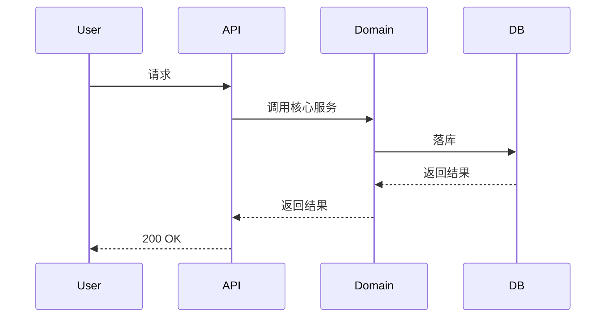
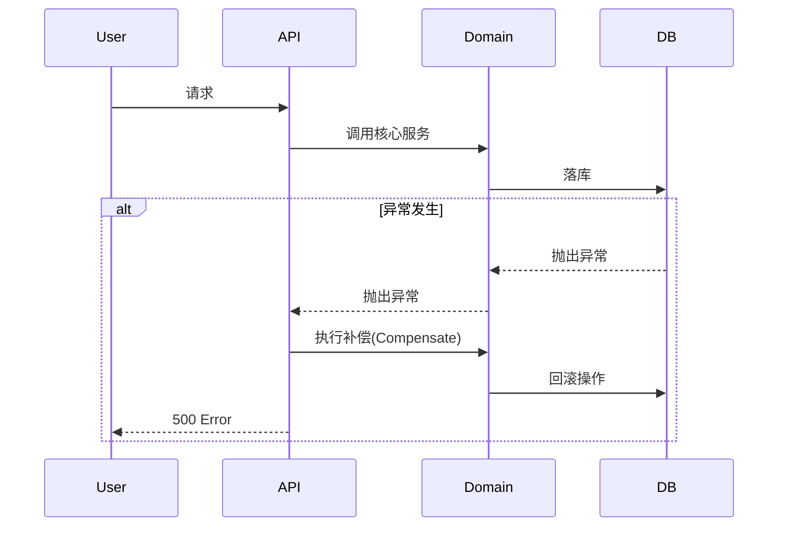

# 流程介绍指令 (Flow Introduction Instructions)

## ⚠️ 执行规则 (EXECUTION RULES)

```
🛑 CRITICAL: 
- 每个步骤输出后 MUST STOP
- 等待用户回复后才能继续
- 一次回复只输出一个步骤的内容
- 违反此规则将导致流程失败
```

此文档指导 Agent 执行场景测试生成的**步骤 2: 流程介绍**。

> [!IMPORTANT]
> **目标**: 介绍业务逻辑与流程，包含 Mermaid 时序图。
> **原则**: 参考 `jl-skills/templates/JL-Template-Scenario-Test-Case.md` 的格式。

---

## 步骤 2.1: 业务逻辑分析与流程介绍

**你必须输出以下内容，然后停止**:

**分析内容**:
1. **正常流程**: 请求如何进入系统、数据如何在各层流转、最终如何落库
2. **异常流程**: 异常如何产生、异常如何传播、补偿/回滚机制
3. **关键组件**: API 层、Domain 层、DB 层、外部依赖

**输出格式**:

````markdown
## 步骤 2: 流程介绍

📊 **进度**: [2/5] 流程介绍
[████████░░░░░░░░░░░░] 40%

| ✅ 已完成 | 🔄 进行中 | ⏳ 待完成 |
|:----------|:----------|:----------|
| 1.场景概览 | 2.流程介绍 | 3.脚本生成 |
| | | 4.报告写入 |
| | | 5.Python测试脚本 |

---

### 2. 业务逻辑与流程 (Logic & Flow)

**核心数据流转逻辑**:

[这里解释核心的数据流转逻辑，包括正常流程和异常流程的处理机制]

**关键组件说明**:
- **API 层**: [说明]
- **Domain 层**: [说明]
- **DB 层**: [说明]
- **外部依赖**: [说明]

---

### 正常流程时序图



---

### 异常流程时序图



---

📋 **确认检查点**

流程介绍是否准确？

- 回复 **确认** → 进入脚本生成
- 回复 **调整流程: [具体说明]** → 我将调整流程描述
- 回复 **调整图表: [具体说明]** → 我将调整时序图

**请确认：** 流程介绍是否正确？
````

**🛑 STOP HERE - DO NOT OUTPUT STEP 2.2 UNTIL USER CONFIRMS**

⚠️ **重要**: 用户未回复"确认"前，禁止执行任何后续步骤，禁止输出步骤2.2的内容。