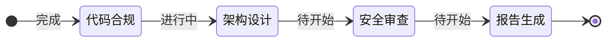

# Agent Skills 通用约定 (Common Conventions)

> [!IMPORTANT]
> 所有 JL-Skills 系列的 Agent 技能**必须**严格遵守本文档定义的行为规范。

## 1. 统一输出目录 (Standard Output Directory)

所有自动生成的文档、图表和状态文件必须遵循以下目录结构：

```text
{Project_Root}/jl-skills/generated/{Skill_Name}/{YYYY-MM-DD}/{Sub_Module}/
```

- **Skill_Name**: 技能的英文标识（如 `code-review`, `ddd-design`）。
- **YYYY-MM-DD**: 执行当天的日期（如 `2023-10-27`）。
- **Sub_Module**: (可选) 如果任务复杂，可按功能模块再分级。

**示例**:
- `jl-skills/generated/code-review/2023-10-27/Review_Report.md`
- `jl-skills/generated/ddd-design/2023-10-27/order-context/Domain_Model.md`

## 2. 元数据管理 (Metadata Management)

Agent 在生成任何文档时，必须在 Frontmatter 或文档头部包含以下元数据：

- **Author**: 当前用户（如无法获取，默认填写 "User"）。
- **Created At**: 生成时间 (YYYY-MM-DD HH:mm:ss)。
- **Tool Version**: 使用的 Agent Skill 版本。

**Action**: 在会话开始时，如果用户未提供，Agent 应询问：“请确认当前作者名称 [默认: User]”。

## 3. 进度可视化 (Progress Visualization)

为了让用户清晰感知当前状态，Agent 的**每一次**实质性回复（Action/Output）都必须在末尾包含一个进度指示器。

**格式 A: 文本进度条 (推荐用于中间步骤)**
```text
---
📊 进度: [======>....] 60% | 当前阶段: 架构设计 | 下一步: 安全审查
---
```

**格式 B: Mermaid 状态图 (推荐用于阶段切换)**
当完成一个大阶段（Phase）时，展示 Mermaid 状态图：



## 4. 状态持久化 (State Management)

Agent 必须维护一个 JSON 状态文件，用于支持断点续传。

- **文件名**: `.agent-state.json` (隐藏文件，存放在输出目录下)
- **写入时机**: 每一个关键 Step 完成后**必须**写入。
- **标准结构**:

```json
{
  "skill_name": "jl-code-review",
  "session_id": "uuid-or-timestamp",
  "author": "User",
  "status": "in_progress", // in_progress, completed, failed
  "current_phase": "architecture_review",
  "progress_percentage": 60,
  "artifacts": [
    "jl-skills/generated/.../report.md"
  ],
  "history": [
    {"phase": "code_compliance", "status": "completed", "timestamp": "..."}
  ]
}
```

**恢复逻辑**:
每次启动技能时，Agent 应优先检查输出目录下是否存在未完成的 `.agent-state.json`。如果存在，**必须**询问用户是否恢复。

---

## 目录结构说明

所有 JL-Skills 相关文件统一存放在 `jl-skills/` 目录下：

```
jl-skills/
├── instructions/          # 指令交互文档
│   ├── INTERACTION_PROTOCOL.md
│   ├── analyze/
│   ├── design/
│   ├── review/
│   └── ...
├── specs/                 # 规范文档
│   ├── COMMON_CONVENTIONS.md
│   ├── DDD与可视化规范.md
│   ├── Java编码规范.md
│   └── 架构设计规范.md
├── templates/             # 文档模板
│   ├── JL-Template-*.md
│   └── ...
└── generated/             # 输出目录（运行时生成）
    ├── analyze/
    ├── design/
    ├── review/
    └── ...
```
