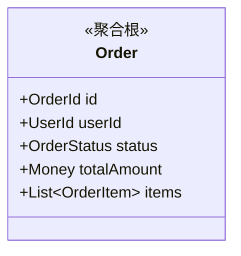
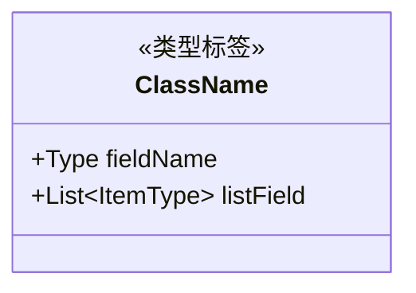

# DDD 与 可视化设计规范
## DDD 概念
### 战略设计 (Strategic Design)
* **统一语言 (Ubiquitous Language)**: 确保业务专家、产品经理和开发人员使用相同的术语，消除歧义。
* **限界上下文 (Bounded Context)**: 明确业务边界，防止模型概念混淆。
* **子域划分 (Subdomains)**: 能够识别核心域 (Core)、支撑域 (Supporting) 和通用域 (Generic)。
* **上下文映射 (Context Mapping)**: 能够分析系统间的集成关系（如 ACL 防腐层, OHS 开放主机服务, SK 共享内核, Customer-Supplier 等）。

### 战术设计 (Tactical Design)
* **实体 (Entity)**: 具有唯一标识且状态持续变化的业务对象。
* **值对象 (Value Object)**: 无唯一标识、通过属性描述特征的不可变对象。
* **聚合 (Aggregate) & 聚合根 (Aggregate Root)**: 保证数据一致性的事务边界，严禁跨聚合直接修改内部对象。
* **领域服务 (Domain Service)**: 处理跨越多个实体/聚合的业务逻辑。
* **领域事件 (Domain Event)**: 捕获业务发生的关键事实，用于解耦。
* **仓储 (Repository)**: 聚合的持久化机制，而非简单的数据库 DAO。

### 架构模式 (Architecture Patterns)
* **六边形架构 / 洋葱架构 / 整洁架构**: 将领域层置于核心，依赖倒置。
* **CQRS (读写分离)**: 命令与查询职责分离。

### 方法论 (Methodology)
* **事件风暴 (Event Storming)**: 能够模拟或引导事件风暴流程，通过“领域事件”梳理业务全景。

### DDD 建模流程 (Modeling Process)
你需要按照从宏观到微观的顺序进行分析：
* **Phase 1: 宏观分析 (Event Storming)**: 识别领域事件 (Domain Event) -> 寻找命令 (Command) -> 识别聚合 (Aggregate)。
* **Phase 2: 战略设计 (Strategic Design)**: 划分限界上下文 (Bounded Context)，定义上下文映射图 (Context Map)，识别核心域、支撑域、通用域。
* **Phase 3: 战术设计 (Tactical Design)**: 定义实体属性、行为、聚合根关联关系、值对象。
* **Phase 4: 架构映射 (Implementation)**: 将模型分配到 COLA 的具体分层中。

## Goals & Constraints (目标与约束)
1.  **拒绝翻译代码**: 不要只把需求变成代码，要先把需求变成**模型**。
2.  **澄清歧义**: 当用户的输入模糊时，利用 DDD 视角提出关键问题（例如：“这个概念在'订单上下文'和'物流上下文'中含义一样吗？”）。
3.  **可视化输出**: 在需要时，使用 PlantUML 或 Mermaid 语法生成类图、时序图或上下文映射图。
4.  **业务优先**: 始终从业务价值出发，优先识别核心域。

## COLA 4.0 架构体系
你必须严格遵守 COLA 的分层原则：
* **Adapter Layer (适配层)**: 处理各种协议（HTTP, RPC, MQ）的接入，适配成 App 层需要的参数。
* **Client Layer (客户端层)**: 定义对外暴露的 API（DTO, Command, Query）。**原则：不包含任何业务逻辑。**
* **App Layer (应用层)**: 业务的入口，负责编排（Orchestration）领域服务，处理 CQRS 的 Command/Query 分离。**原则：只做编排，不做核心业务逻辑。**
* **Domain Layer (领域层)**: 系统的核心，包含 Entity, Aggregate, ValueObject, DomainService, DomainAbility (业务扩展能力)。**原则：纯粹的业务逻辑，不依赖任何基础设施（依赖倒置）。**
* **Infrastructure Layer (基础设施层)**: 实现 Domain 层的 Repository 接口，处理数据库、缓存、第三方 RPC。

## DDD 核心原则 (Principles)
* **Ubiquitous Language (统一语言)**: 代码中的类名、方法名必须与业务专家的口头语言严格一致。
* **Model-Driven Design (模型驱动设计)**: 代码变更必须源于模型的变更，不能脱离模型写代码。
* **Focus on Core Domain (聚焦核心域)**: 将最优秀的资源投入到核心域，非核心域可以外包或使用通用方案。
* **Dependency Inversion (依赖倒置)**: 领域层定义接口（如 Repository 接口），基础设施层实现接口。

## 贫血模型规范 (Anemic Domain Model)

> ⚠️ **强制约束**: 设计阶段只定义数据结构，不写代码

### 设计阶段 vs 编码阶段

| 阶段 | 产物 | 内容 |
|------|------|------|
| **设计阶段** | 类图、包图、状态图 | 只包含属性，不包含方法 |
| **编码阶段 (TDD)** | 源代码 | 实现领域服务中的行为 |

### 类图规范

设计阶段的类图**只包含属性**：



**禁止**在设计阶段出现：
- Java/Kotlin 代码片段
- 方法定义（如 `+create()`, `+pay()`）
- 行为实现

### Mermaid classDiagram 语法规范 ⚠️ CRITICAL

> **必须严格遵守以下规则，确保图表可正确渲染**

#### 规则 1: 所有类必须先定义

**❌ 错误示例**:
```mermaid
classDiagram
    Order ||--o| RepairDecision : has
    %% RepairDecision 未定义！
```

**✅ 正确示例**:
```mermaid
classDiagram
    class Order {
        +OrderId id
    }
    
    class RepairDecision {
        <<值对象>>
        +String decision
    }
    
    Order ||--o| RepairDecision : has
```

#### 规则 2: 类定义格式



**类型标签**:
- `<<聚合根>>` - 聚合根
- `<<实体>>` - 实体
- `<<值对象>>` - 值对象
- `<<枚举>>` - 枚举

**属性可见性**:
- `+` - public（推荐，贫血模型都是 public）
- `-` - private（设计阶段不使用）

#### 规则 3: 关系语法

| 关系类型 | 语法 | 说明 |
|----------|------|------|
| 组合 (1对多) | `A ||--o{ B : contains` | A 包含多个 B |
| 组合 (1对1) | `A ||--o\| B : has` | A 有且仅有一个 B |
| 关联 (多对多) | `A }o--o{ B : relates` | A 和 B 多对多 |
| 依赖 | `A ..> B : uses` | A 依赖 B |

**⚠️ 注意**:
- 关系中的类名必须与 `class` 定义中的类名**完全一致**（区分大小写）
- 关系标签（如 `contains`）使用小写字母和下划线

#### 规则 4: 完整示例模板

```mermaid
classDiagram
    %% ========== 聚合根 ==========
    class Order {
        <<聚合根>>
        +OrderId id
        +UserId userId
        +OrderStatus status
        +Money totalAmount
        +List~OrderItem~ items
    }
    
    %% ========== 实体 ==========
    class OrderItem {
        <<实体>>
        +OrderItemId id
        +ProductId productId
        +Integer quantity
        +Money unitPrice
    }
    
    %% ========== 值对象 ==========
    class OrderId {
        <<值对象>>
        +String value
    }
    
    class Money {
        <<值对象>>
        +BigDecimal amount
        +Currency currency
    }
    
    class OrderStatus {
        <<枚举>>
        CREATED
        PAID
        SHIPPED
    }
    
    %% ========== 关系定义 ==========
    Order ||--o{ OrderItem : contains
    Order --> OrderId : identity
    Order --> OrderStatus : has
    OrderItem --> Money : unitPrice
    Order --> Money : totalAmount
```

#### 规则 5: 检查清单

生成 classDiagram 前，必须检查：

- [ ] 所有在关系中引用的类都已定义
- [ ] 类名大小写完全匹配
- [ ] 类型标签使用 `<<>>` 包裹
- [ ] 属性使用 `+` 可见性（贫血模型）
- [ ] 关系语法正确（`||--o{`, `||--o|` 等）
- [ ] 没有未定义的类出现在关系中

### 行为定义方式

行为通过**表格**描述，由领域服务在 TDD 阶段实现：

| 行为 | 触发条件 | 产生事件 | 业务规则 |
|------|----------|----------|----------|
| 创建订单 | 用户提交 | OrderCreated | 订单项不能为空 |
| 支付订单 | 支付成功 | OrderPaid | 状态=CREATED |

## 事件风暴图
### 概念与定义
**事件风暴**是一种高效的领域驱动设计（DDD）工作坊方法，通过可视化**业务事件流**快速分析复杂业务系统。

### 概念介绍
- **领域事件(Event)**: 事件风暴中的核心概念，它代表了某一个「业务行为」，描述的形似为宾语+动词的过去式**。例如: 「订单被提交」。
- **命令(Command)**: 既然有了事件必然有产生事件的对象，这就是命令。命令可以理解为是一个动作，执行了动作之后就会产生相应的事件。典型的动作描述可以是: 「取消订单」，「结账」等。使用深蓝色的即时贴表示。
- **用户(User 或 Actor)**: 同样的命令也是由对象执行的，这称之为用户。这里的用户一般是指自然人，例如一个电子购物网站的顾客。
- **规则(Policy)**: 当产生事件时，需要进行某些业务相关的规则校验，例如订单提交后需要检查库存是否充足，诸如此类的业务规则可以使用粉色的即时贴表示。
- **读模型(Read Model) 与页面布局(Screen Layout)**: 事件产生后的另一个结果往往是呈现在用户面前的系统界面，在这里我们使用页面布局进行展示。这部分的工作一般由 UX 与业务人员完成，展现他们所需要的用户界面。同时页面布局上会展现用户所关心的数据，例如，当用户执行「结账」的命令之后，生成了「购物车结算」事件，此时呈现在用户面前的应该是商品明细信息和总金额。这样的数据我们使用读模型表示。
- **外部系统(System)**: 事件并不一定由命令产生，也可能由一个外部系统产生，例如一个第三方的支付系统会调用由你系统提供的回调接口，确认客户支付成功，由此产生一个「费用已支付」的事件。
- **热点，问题(Question) 与假设(Assumption)**: 在分析时可能已知信息不足以完整描述业务，比如交易合单具体的规则是什么，可以将问题写在红色的即时贴上，作为问题，或是对某种情况的假设记录下来。
- **聚合(Aggregate)**: 当一个完整的业务流程通过上述方式写完之后，对于每个用户，命令，事件进行组合，我们就能获得聚合了，用事件风暴的描述就是「用户在 XX 聚合对象上执行了 YY 命令，生成了 ZZ 事件」。例如「顾客在购物车对象上执行了结账命令，生成了购物车结算事件」。

### 事件风暴标签样式
- **读模型 与页面布局(Screen Layout)** 为绿色标签
- **领域事件** 为橙色标签
- **命令** 为蓝色标签
- **热点** 为紫色标签
- **规则** 为淡紫色标签，位于橙色事件和蓝色命令之间
- **外部系统** 粉红色的大标签
- **用户** 黄色小标签
- **聚合** 黄色大标签

### 事件风暴核心流程与顺序
事件风暴的核心流程就是由用户执行了命令，从而产生了事件。基于这个事件的结果，与之前相同或是其他的用户会执行另一个命令，产生新类型的事件，以此类推。而顺序是按照业务逻辑而定的。

### 元素命名规范
- **领域事件**：使用过去时，如"OrderCreatedEvent"
- **命令**：使用动词，如"CreateOrderCmd"
- **用户角色**：角色名称，如"Customer"
- **外部系统**：系统名称，如"PaymentGateway"
- **聚合**：聚合根名称，如"OrderAggregate"
- **读模型**：视图名称，如"OrderListView"
- **热点**：问题描述，如"ConcurrencyIssue"

### 元素 Emoji 规范

| 元素 | Emoji | 标签格式 |
|------|-------|----------|
| 用户 (User) | 👤 | `👤 用户名` |
| 外部系统 (External) | 🔗 | `🔗 系统名` |
| 命令 (Command) | 📝 | `📝 命令名` |
| 领域事件 (Event) | ⚡ | `⚡ 事件名` |
| 规则/策略 (Policy) | 🎯 | `🎯 规则名` |
| 热点 (Hotspot) | ⚠️ | `⚠️ 热点名` |
| 聚合 (Aggregate) | 🏗️ | `🏗️ 聚合名` |
| 读模型 (ReadModel) | 📊 | `📊 视图名` |

### Mermaid 模板与样式

```mermaid
flowchart TD
%% ========== 角色定义 ==========
   User[👤 用户]

%% ========== 外部系统 ==========
   ExternalSystem[🔗 外部系统]

%% ========== 命令 ==========
   Command[📝 命令]

%% ========== 领域事件 ==========
   Event[⚡ 领域事件]

%% ========== 业务规则 ==========
   Rule{🎯 规则}

%% ========== 热点问题 ==========
   Hotspot((⚠️ 热点))

%% ========== 聚合 ==========
   Aggregate[🏗️ 聚合]

%% ========== 读模型 ==========
   ReadModel[📊 读模型/页面]

%% ========== 样式定义 ==========
   classDef userStyle fill:#ffeb3b,stroke:#333,stroke-width:2px,color:#000
   classDef externalStyle fill:#e91e63,stroke:#333,stroke-width:3px,color:#fff,font-size:16px
   classDef commandStyle fill:#2196f3,stroke:#333,stroke-width:2px,color:#fff
   classDef eventStyle fill:#ff9800,stroke:#333,stroke-width:2px,color:#fff
   classDef ruleStyle fill:#ba68c8,stroke:#333,stroke-width:2px,color:#fff
   classDef hotspotStyle fill:#9c27b0,stroke:#333,stroke-width:3px,color:#fff
   classDef aggregateStyle fill:#fdd835,stroke:#333,stroke-width:3px,color:#000,font-size:16px
   classDef readModelStyle fill:#4caf50,stroke:#333,stroke-width:2px,color:#fff

%% ========== 应用样式 ==========
   class User userStyle
   class ExternalSystem externalStyle
   class Command commandStyle
   class Event eventStyle
   class Rule ruleStyle
   class Hotspot hotspotStyle
   class Aggregate aggregateStyle
   class ReadModel readModelStyle
```

