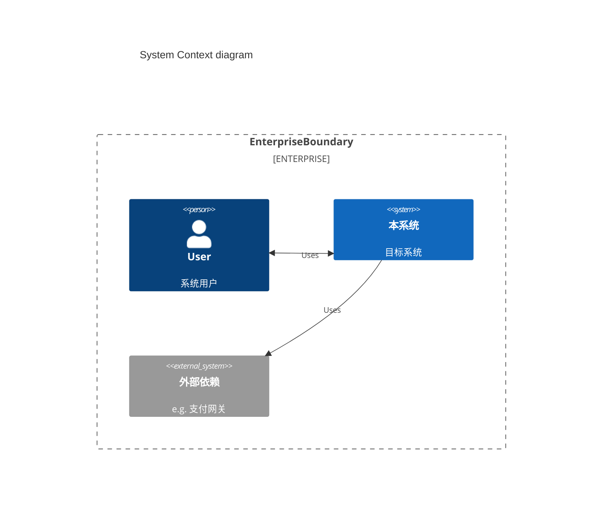

# 系统架构设计

## 1. C4 架构图 (System Context)
> 描述本系统在企业IT架构中的位置。

## 2. 关键架构决策 (ADR Summary)

> 记录"为什么这么做"，避免后来者重复踩坑。

| ID | 决策项 | 决策结论 | 背景/原因 |
| --- | --- | --- | --- |
| ADR-001 | 基础框架 | Spring Boot 3 | 拥抱云原生，JDK 17 长期支持 |

## 3. 技术/逻辑债务 (Debt)

* **逻辑债**: (待补充)
* **代码债**: (待补充)
