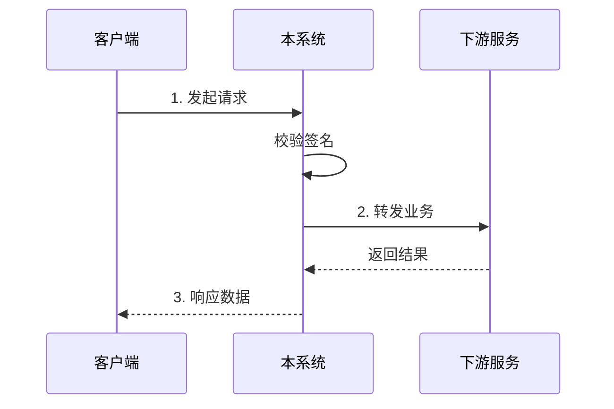

# 业务接入指南

## 0. 概述 (Overview)
- 描述业务逻辑
- 相关接口
- 准备工作

## 1. 交互时序图 (Interaction Flow)
> 描述调用方应该如何与本系统交互。

## 2. 核心业务流程

### 2.1 状态机流转

(请在此处补充状态流转图)

## 3. 常见错误码处理 (FAQ)

| 错误码 | 含义 | 建议处理方式 |
| --- | --- | --- |
| `20001` | 余额不足 | 提示用户充值，不要重试 |
| `50009` | 频率限制 | 触发限流，请并在 5s 后重试 |
