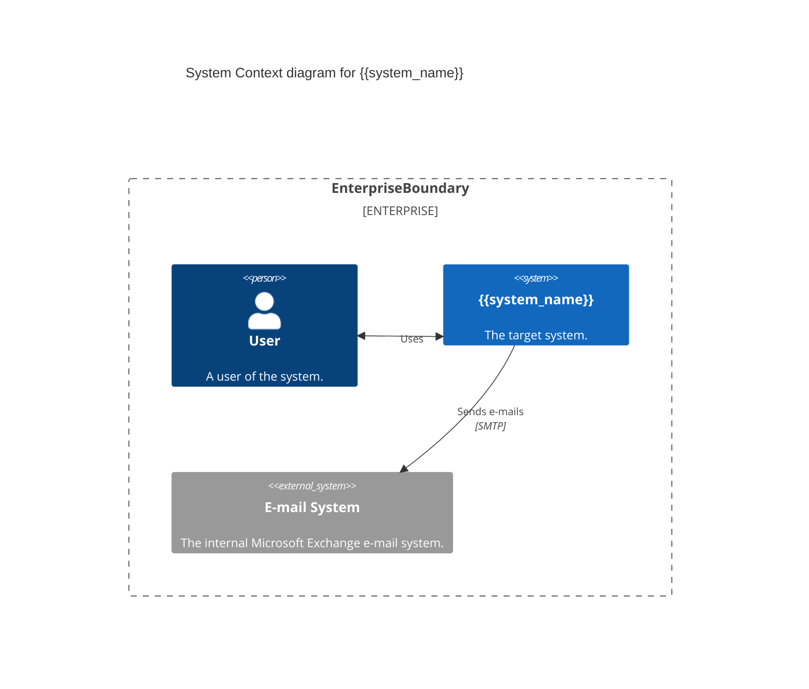
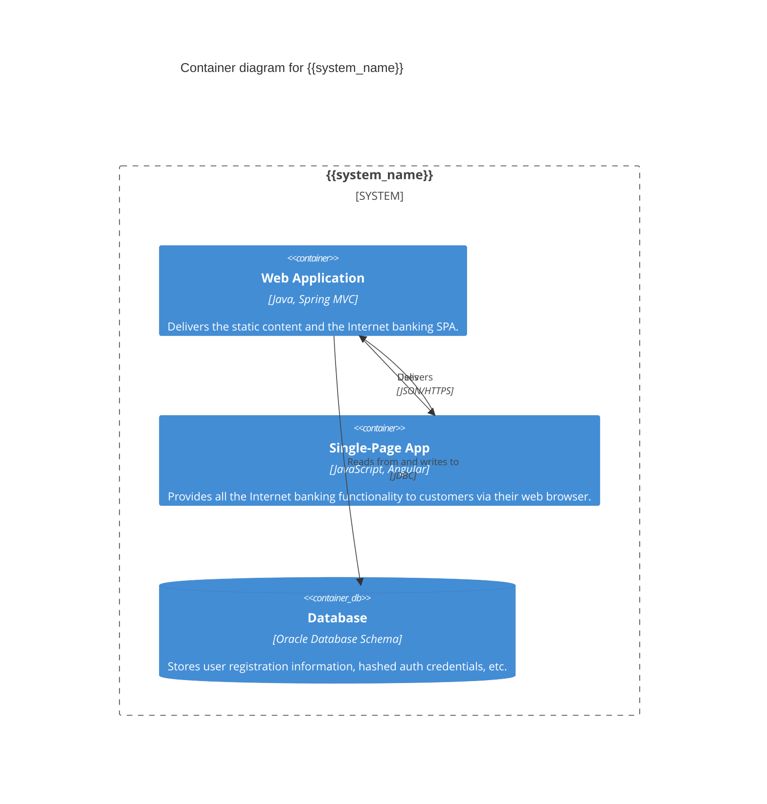

# 产研通用需求设计文档

> **日期**: {Timestamp}
> **需求规模**: {Scale}

## 基本信息（快速对齐核心）
- 业务背景：[简述项目的业务背景，概括对需求的初步理解]
- 核心诉求：[用「动词+对象+目标」格式，如「实现订单一键支付功能」]
- 边界定义：
  - In-Scope: [本次必须实现的功能核心]
  - Out-of-Scope: [明确不做的内容，防止需求蔓延]
- 依赖条件：[明确业务/技术依赖，如「依赖第三方微信支付接口（已申请）、会员系统用户余额数据」]
- 利益攸关者分析：[明确哪些角色或用户对需求有影响,|角色|职责|诉求|关注点|]
- 数据字典: [将需求中所有的业务和技术名词进行汇总整理统一语言,|术语|含义|属性名称|]

## 需求细化
### 业务流程细化
#### 主业务流程
- 流程描述：[按「角色操作→系统响应」步骤拆解]
- 流程图和时序图：[ **必须** 使用 Mermaid 语法绘制主业务流程图和时序图]

#### 分支业务流程
- 分支流程描述：[包含正常业务的不同路径和出错场景处理，|分支名称|触发条件|流程描述|涉及角色操作|]

### 功能清单
- 功能点描述：[|所属模块|功能点|依赖条件(数据库表,第三方接口等)|对外能力(提供接口/消息等)|原始描述|完善描述|依赖业务规则集合|]

### 用户故事梳理
- 用户故事列表:[|用户类型|用户故事|验收标准|]
  用户故事模板：[用户类型] 想要 [做什么] 以便 [达到什么目的]

### 业务信息汇总
- 业务规则汇总：[列出需求中和本次任务相关的所有业务规则，|相关功能|业务规则|描述|]
- 关键业务信息: [详细描述关键业务信息,能用图描述的使用图描述,如「商户报备需要通知X个渠道, 顺序为A,B,C」]

## 功能实现
### 当前系统架构
- 系统上下文[**必须** 使用 Mermaid 语法绘制 C4mod图]

#### C4 Context Diagram

#### C4 Container Diagram

### 代码对需求的覆盖情况
- 已实现功能：[分析现有代码已实现的需求功能，对应到具体的代码模块或类，如UserController类实现了用户注册和登录功能]
- 未实现功能：[指出原始需求中哪些功能现有代码尚未实现，如支付功能仅实现了前端页面，后端支付接口尚未开发]

### 关键功能实现方案
- 功能实现方案：[详细描述功能实现方案，如使用哪些技术、算法、框架等，以及实现过程中遇到的问题及解决方法, 应包含流程图描述]
- 数据库设计：[详细描述数据库设计，如表结构、索引、外键关系等，以及数据库操作的实现方案]

### 代码可维护性与扩展性分析
- 代码结构：[简要分析现有代码的结构特点，如是否采用分层架构、模块化设计等，判断其合理性]
- 可维护性问题：[根据代码分析，指出可能存在的可维护性问题，如代码注释不清晰、方法过长等]
- 扩展性建议：[针对业务需求的变化，提出对现有代码进行扩展的建议，如增加新的业务功能时，如何在现有代码结构基础上进行最小化修改]