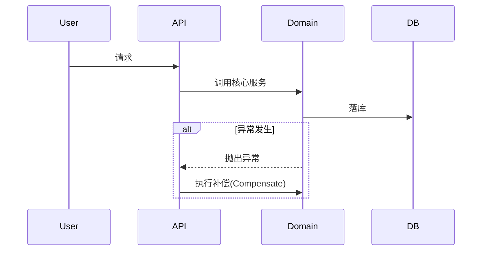

# 场景测试报告

> **日期**: {Timestamp}
> **相关模块/功能**: {Module/Feature}

## 1. 测试场景概览 (Test Scenarios)
| ID | 场景名称 | 前置条件 | 预期结果 | 关键测试点 |
|---|---|---|---|---|
| TC-001 | 正常流程-启动成功 | 用户存在，权限校验通过 | 200 OK, 流程实例创建 | 数据落库一致性 |
| TC-002 | 异常流程-事务回滚 | Step 2 业务报错 | 500 Error, 触发补偿 | 流程实例被清理 |
| TC-003 | 边界测试-[具体边界] | [输入] | [输出] | [校验点] |

## 2. 业务逻辑与流程 (Logic & Flow)
> 这里解释核心的数据流转逻辑。
{Summary_Content}



## 3. 执行脚本集 (Execution Scripts)

### A. 接口请求 (cURL)
```bash
curl -X POST "http://localhost:8080/your/api/path" \
  -H "Content-Type: application/json" \
  -H "Authorization: Bearer {{token}}" \
  -d '{
    "procKey": "sample_process",
    "businessData": { ... }
  }'
```

### B. 数据准备与校验 (SQL)
```sql
-- 1. 前置清理/准备
DELETE FROM biz_table WHERE batch_no = 'TEST_001';

-- 2. 预期结果校验 (验证脚本)
SELECT status, proc_inst_id FROM biz_table WHERE batch_no = 'TEST_001';
-- 预期: status 应该为 'CREATED'
```

### C. 自动化验证 (Python)
```python
import requests
import json

def test_scenario_001():
    url = "http://localhost:8080/your/api/path"
    payload = { ... }

    # 1. 发起请求
    resp = requests.post(url, json=payload)
    assert resp.status_code == 200

    # 2. 校验响应字段
    data = resp.json()
    assert data['code'] == 'SUCCESS'
    print("TC-001 Passed!")

if __name__ == "__main__":
    test_scenario_001()
```

